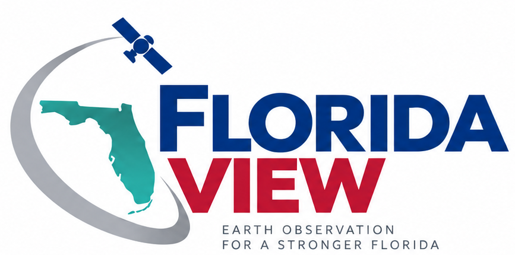

# Florida is our living laboratory

FloridaView connects **Earth observation, remote sensing, education, and open geospatial resources** to the landscapes and challenges that define Florida. Hosted at Florida Atlantic University and part of the AmericaView network, FloridaView is a public gateway for learners, educators, researchers, and practitioners.

::::{grid} 1 1 3 3
:::{card} Mission
:link: pages/mission.md
**Why FloridaView exists**
^^^
Earth observation education, workforce development, data access, and applied geospatial learning for Florida.
:::
:::{card} Florida Data
:link: pages/data.md
**Find authoritative data**
^^^
A curated gateway to Florida, federal, and research data resources without duplicating authoritative archives.
:::
:::{card} Tutorials
:link: pages/tutorials/index.md
**Learn by doing**
^^^
Start with the ten-lab LiDAR learning path, then continue to trusted AmericaView and NASA training resources.
:::
::::

## Featured learning path: LiDAR remote sensing

Ten labs progress from **finding and viewing LiDAR** to **classification, vegetation analysis, urban 3D modeling, wetland delineation, and coastal inundation**. Each lab is maintained in one Markdown source and publishes as both a responsive web tutorial and a downloadable PDF.

[Start the LiDAR learning path →](pages/lidar-labs/index.md)

## Learn through Florida-relevant problems

::::{grid} 1 1 3 3
:::{card} Coastal resilience
LiDAR-based elevation analysis supports coastal inundation and sea-level-rise applications.
:::
:::{card} Wetlands & water
Terrain products connect remote sensing methods to wetland delineation and Florida's water-data landscape.
:::
:::{card} Urban systems
Point-cloud classification and 3D modeling translate LiDAR into information about the built environment.
:::
::::

## One source, two student formats

FloridaView tutorials are maintained once in GitHub. The same source publishes to the web and generates a formatted PDF for download, keeping annual updates straightforward and preventing the web and print versions from drifting apart.

## Part of the AmericaView network

FloridaView is a StateView program in AmericaView, a nationwide university-based network advancing Earth observation education through remote sensing science, applied research, workforce development, technology transfer, and community outreach.

[Visit AmericaView →](https://americaview.org/)
