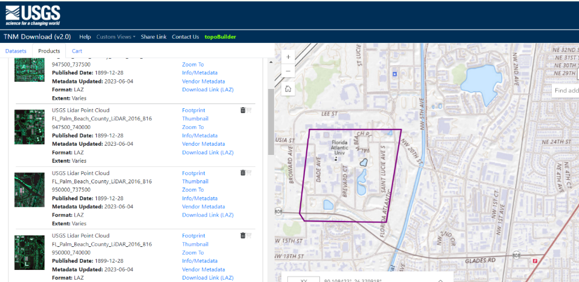

## Overview
This FloridaView laboratory is part of the **LiDAR Remote Sensing Learning Path**. It has been migrated from the original course document into a single Markdown source so the web tutorial and downloadable PDF can be updated together.

## Learning objectives
- Find and download public LiDAR point-cloud data from authoritative sources.
- Explore raw LiDAR data with desktop and web-based viewers.
- Identify additional public LiDAR data portals for future work.

## Prerequisites and software
- **Software:** Quick Terrain Reader and web-based LiDAR viewers
- Review the [Software & Access](../software.md) page before starting.
- **Teaching data: not yet published.** The named course datasets are unavailable for public download. Check the [FloridaView Data](../data.md) page for availability; FAU students should use the dataset supplied by their instructor. Procedures that require these files cannot be completed from the website alone.

:::{note}
**FAU students:** use the submission template available from this page's download menu. Course-specific submission instructions may still be provided through your current FAU course environment.
:::

---

In this lab, you will learn how and where to download lidar raw data from several websites and how to display the raw data in the **Quick Terrain Reader**, a free lidar data view package.

## Data
Use the corresponding dataset listed on the [FloridaView Data page](../data.md).

## Part I Download LiDAR raw data
USGS provides free lidar DEM and point cloud data.

- Go to USGS National Map data download web:

<https://apps.nationalmap.gov/downloader/>

- Using the Polygon to put an area of interest such as FAU Boca campus (**note: lidar original point cloud data is huge, thus set up a small area such as your living building/working building or FAU campus where you are familiar with**)

- Select Elevation Source Data (3DEP)-Lidar, IfSAR, then select Lidar Point Cloud (LPC) and in LAS, LAZ format

- Search Products, you can see many lidar tile point cloud data showing in the list

- Lidar LPC is often a huge dataset and thus organized into tiles with each tile covering a small area

- You can down 4 tiles covering our SE building areas as illustrated below and then download them or somewhere you are interested in on campus or your living/working place. I have downloaded four tiles around SE 43 building from this web and saved them at Lab1”. I also created a readme.txt in this folder.

You can explore this web to download data, view the data using POTREE VIEWER.

USGS also provides 3DEP LidarExplorer:

Alternatively, a web-based LiDAR point cloud viewer for USGS 3DEP LiDAR search, display, can be accessed by:

<https://usgs-lidar.gishub.org/>

Tutorial: <https://gishub.org/blog/usgs-lidar-search/>

You may also find other websites providing free lidar data. One important source of lidar over US coastal areas is NOAA Digital Coast’s Data Access Viewer, where imagery, Land Cover and Elevation products are available <https://coast.noaa.gov/dataviewer/#/>. Lidar data is under Elevation/Lidar.

Other Sources of LiDAR Data

- NSF [Open Topography](http://www.opentopography.org/)

- Idaho LiDAR Consortium (<http://www.idaholidar.org/>) is providing LiDAR data collected in Idaho. This data is also now hosted by NSF Open Topography

- Puget Sound Lidar Consortium ([PSRC](http://pugetsoundlidar.ess.washington.edu/)). Data available through this site is in .LAZ form, so you need to download the open-source Lazzip (<http://www.laszip.org/>) in order to decompress the file.

- United State Interagency Elevation Inventory ([United States Interagency Elevation Inventory (noaa.gov)](https://www.coast.noaa.gov/inventory/)

## Part II Display LiDAR raw data
Quick Terrain Reader is a free 3-D lidar visualization tool which can be used to display lidar data in ASPRS LAS/LAZ format. The tool can be downloaded at <https://appliedimagery.com/download/> and it is also available at the corresponding FloridaView lab dataset

**Note: Intel’s updated graphics drivers can cause a QT Reader crash when loading point clouds (LAS/LAZ files). If this is happening, open QT Reader, go to the Help Menu \> OpenGL Resources, and disable Partial Rendering. Proceed normally.**

After installing the software on your PC, you can start it and load in the LAS lidar data you just downloaded using Add Module, and then play your lidar data and try the marker, measure, Model Information functions, etc. **You can also load in the FAU lidar dataset I downloaded** in the lab1 data folder to practice this lidar software. The Model Information function is useful. You can find your LAS data, the total number of points, point density, data extents, and projection information.

## Assignments
## Homework 1:

Download lidar raw point cloud data from one of the above websites for your interested area and save your LAS/LAZ file to your lab 1 working folder. This file will be used for the following homework (5 points).

## Homework 2:
Get a screenshot of your lidar data downloaded from **Homework 1** by coloring the elevation (a screenshot with a meaning caption); describe your dataset including where did you download your lidar data, which area your lidar data covering and why you are interested in this area, the point density of your point cloud data, and the projection used in your lidar dataset.

## Submission
Using the provided template WORD to prepare your submission and **Turn in** your homework in PDF format. You are also required to introduce yourself in the Discussion of canvas.
