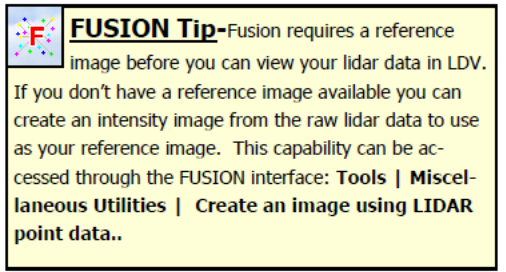
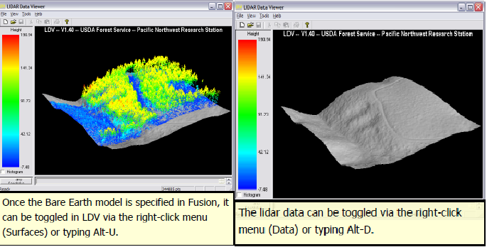

## Overview
This FloridaView laboratory is part of the **LiDAR Remote Sensing Learning Path**. It has been migrated from the original course document into a single Markdown source so the web tutorial and downloadable PDF can be updated together.

## Learning objectives
- Load LiDAR example data and reference imagery in FUSION.
- Select a sample and navigate the LiDAR Data Viewer (LDV).
- Add a bare-earth model and explore FUSION display options.

## Prerequisites and software
- **Software:** FUSION/LDV
- Review the [Software & Access](../software.md) page before starting.
- **Teaching data: not yet published.** The named course datasets are unavailable for public download. Check the [FloridaView Data](../data.md) page for availability; FAU students should use the dataset supplied by their instructor. Procedures that require these files cannot be completed from the website alone.

:::{note}
**FAU students:** use the submission template available from this page's download menu. Course-specific submission instructions may still be provided through your current FAU course environment.
:::

---

FUSION/LDV is a free Lidar package allowing data conversion, analysis, and display. 3-D terrain and canopy surface models and Lidar data can be fused with 2-D imagery in FUSION (<http://forsys.cfr.washington.edu/FUSION/fusion_overview.html>). The latest version, example data, and manual can be downloaded at <http://forsys.cfr.washington.edu/FUSION/fusionlatest.html>. You can install FUSION/LDV on your own PC or laptop following the steps described

FUSION is independent of other GIS or remote sensing software packages. If you have problems installing it on your own PC, you can select Install archive which does not need install, and you can run it directly. I have downloaded the archive and saved it on “**the corresponding FloridaView lab dataset**”.

You can copy entire **fusionlatest** folder to your PC and run FUSION64.exe assuming your windows system is 64-bit system.

In this lab you will be using the fully prepared example data to explore the basics of FUSION.

## Data
The named teaching dataset is not yet available for public download; see the [data availability notice](../data.md).

## Overview of Major Steps for this Lab
1\. Start Fusion from your own PC if you have installed it and Load the Example Lidar Data

2\. Load a Reference Image

3\. Select a Sample to View in LDV

4\. Add a Bare Earth Model

5\. Explore FUSION’s Sampling and Display Options

**Part 1: Start Fusion and Load the Example Lidar Data**

1.  Start Fusion: Click **Start | Programs | FUSION | FUSION**. If you did not install it but copied the **fusionlatest** folder to your PC, open that folder and double-click **FUSION64.exe** to start it.

2.  **Click** the **Raw Data button** on Fusion toolbar to display the **Open** dialog box.

3.  Navigate to the data folder and Select the sample dataset (**lda_4800k_data.lda**) and **Click, Open** (You can download the sample data from FUSION web or copy the sample data to your own PC). This will open the **Data Files** dialog.

4.  The **Data Files** dialog allows you to change the display Symbology of the Lidar data in the Fusion window—but, we strongly recommend that you accept the defaults (especially the Symbol set to None) for now, Click, **OK** (read the sidebar before making any changes).

5.  Save your Fusion project by Clicking the Save icon or **File\| Save As**.

6.  Name the project **Lab02.dvz** and Save it in a new folder named **Fusion_Projects**.

**Part 2: Load a Reference Image**

1.  Click the **Image button** (located on Fusion toolbar). Select the sample orthophoto **orthophoto_4800k.jpg** from the sample data folder and Click **Open**. The image will automatically display in the Fusion viewer. If you want to **zoom-in** to any part of the image, Right Click on the location to zoom to. **Zoom-out** by Clicking the **Zoom to extents** button (an example of LDV is below).

2.  You are now ready to view the Lidar data in the **Lidar Data Viewer (LDV).**

**Part 3: Select a Sample to View in LDV**

To create a sample and view the corresponding Lidar data in 3D:

1.  Position the cursor over an area of interest in the orthophoto, **Left Click** and drag a small box (called a stroked box) over the area and release the left mouse button—this is your sample. Note: a small sample works better (faster) than a large sample.

2.  The sample box will be highlighted in the Fusion viewer and LDV, Fusion’s 3D viewer, will automatically appear and load the Lidar data within your sample boundary.

3.  Use the **Basic LDV Navigation Tips** (Table 1) until you are comfortable with your ability to control the data cloud.

Table 1 **Basic LDV Navigation Tips**

| Control | Action |
|---|---|
| **LMB + move mouse** | Grab and rotate the displayed data vertically or horizontally. Think of the point cloud as being inside a glass ball that you roll with the mouse. |
| **LMB + Ctrl + move mouse down** | Zoom in. |
| **LMB + Ctrl + move mouse up** | Zoom out. |
| **RMB** | Open the LDV options menu. |

*LMB = left mouse button; RMB = right mouse button. For the complete LDV keystroke list, use the **About LDV and Keystroke Guide** button in the lower-left corner of LDV.*

**Part 4: Add a Bare Earth Model**

1.  Close the **LDV** and return to **FUSION** (it will still be running & your last sample will be displayed).

2.  Click the **Bare earth** button (located on the Fusion toolbar).

3.  Select the sample terrain model (**4800K_ground_surface.dtm**) from the sample data folder and Click, **Open.**

4.  Within the **Surface model options** window, you can accept the defaults or define contour intervals and line colors. Once you have chosen intervals and colors or accepted the defaults, Click, **OK**. The terrain model will be displayed in the Fusion viewer as a contour map over the orthophoto.

5.  Click the **Repeat last sample…** button (located on the Fusion toolbar). This will display the same lidar data cloud as before—but in a moment we will also view the bare earth surface…

6.  Right-click within the LDV viewer to access the **Right Click Menu**.

7.  Click on **Surfaces** (or use the Alt-U keyboard option). The bare earth surface will automatically display with your lidar data cloud.

8.  Access the right-click menu again and Click on **Data** to toggle the data off (or type Alt-D). This will allow you to inspect the bare earth surface without the data cloud. To turn the data back on use the right click menu and Click on **Data** again.

**Part 5: Explore Fusion’s Sampling and Display Options**

Fusion offers several ways to sample and view Lidar data. We’ll explore several of these options in this section and you’ll use many of the remaining options in subsequent exercises.

1.  In the FUSION window Click the **Sample options** button to open the Sample Options dialog (see Appendix 1).

2.  Under the **Sample shape** section, Select, **Stroked circle** (the default is Stroked box) and Click, **OK**.

3.  Select a **small stroked-circle sample** in the Fusion window and view the results in the LDV.

4.  Close the **LDV**.

5.  Return to the Sample options and change the sample shape back to **Stroked box**.

6.  In the **Decimation** section, increase the value to **200** and Click **OK**.

7.  In the Fusion window Select a **large stroked-box sample** (suggestion: make the stroked box cover about 1/2 the size of the reference image). It may take a few minutes to extract the sample but the results display very fast in LDV. Please notice that the ground is not flat within the sample area as you view the data in LDV—you’ll make it flat in the next sample.

8.  Return to the Sample options and Select (check) the **Subtract ground elevations from each return** in the **Options section** and Click, **OK**.

9.  Click the **Repeat Last Sample** button. This will repeat the last sample area but now the data will appear in LDV on flat terrain—this is very useful for comparing heights above ground level.

10. Return to the Sample options and change the **Decimation value** back to **1** and de-select the **option to subtract ground elevations.**

11. Select the **Bare Earth Filter option** to **Exclude points close to surface** and increase the tolerance to **2**.

12. Click, **OK** to close the sample options dialog.

13. Select a small **stroked box sample** in the Fusion window. Note that the points close to the ground have been excluded from displaying in LDV.

14. Return to the Sample options and Select the **Include all points** option under **Bare Earth Filter**.

15. In the Sample options window, under the **Color** options Select, **Color using image** and Click, **OK**.

16. Click the **Repeat last sample** button. You should notice that each lidar return is now painted the color of the corresponding reference orthophoto image. Keep LDV open.

> To this point, you’ve been controlling the display and sample options from Fusion’s Sample Options dialog box. Now, we’ll explore a few of the display options within LDV…

17. Access the right-click menu and **Toggle** (either on or off) the **Draw all points when moving** option. **Click-and-drag** to move the data sample. If you’ve toggled the Draw all points… option **on**, the responsiveness of your display may be sluggish (but it looks good) and if you toggle the option **off**, the LDV display will be very responsive (but it won’t look as good).

18. Set the **Draw all points…** option to suit your computer and your preferences.

19. Access the right-click menu again and Click the **Marker…** option.

20. Experiment with the **Marker Type** and **Marker Size** options—however, be aware that the sidebar note is particularly applicable to some of the Marker Types. If in doubt, keep the marker type set to **Points**.

21. Back in the Fusion window, Click the **Sample Options** button.

22. Enable the **Color by Intensity** option.

23. Click, **OK** and then Click, **Repeat Last Sample**. The LDV viewer will display returns according to their intensity value (or the near-infrared spectral value). Intensity information can be helpful to interpret ground features. However, because the intensity information of the ground features is clustered on only a small portion of the displayed intensity range, the default display parameters make the data difficult to interpret. Let’s adjust the intensity display parameters to improve interpretation.

24. Click the **Histogram** checkbox on the left side of the LDV viewer (**see graphic to left**). The histogram will display (black) along the color legend.

> You should see that most of the intensity values are clustered in the lower half of the available intensity range. Let’s truncate the available range to the approximate range of the intensity values (so that we can interpret the Lidar data better).

25. Write down the approximate low and high intensity values that capture most of the histogram (**see graphic to left**).

26. Click the **Sample Options** button in the Fusion window.

27. Enable **Truncate Attribute Range** (in the Color section).

28. Enter your approximate **minimum** and **maximum** histogram values.

29. Click, **OK** and then Click, **Repeat Last Sample**.

> Now you’ve effectively stretched your intensity data to cover the full color legend for improved interpretation (see figure to the left). High intensity values (or high near-infrared values) for natural communities most likely represent photo-synthetically active vegetation, and in some cases may represent dry bare soil. Lower intensity values likely represent: 1) wet, bare soil, 2) water, or 3) less photo-synthetically active vegetation. The figure to the left illustrates how the data and histogram changes with truncation.

To conclude this lab, continue to interact with the data in LDV and experiment with the following items on the right-click menu:

- Wiggle-vision (Alt-W)

- Overhead View (Alt-O)

- Reset Orientation (Alt-R)

- Reset Zoom (Alt-Z)

- Image Plate (Alt-P)

30. Turn the truncate function off and choose the color by option that seams most appropriate for general visualization (color by height is recommended).

31. Save the project: **File \| Save**

**FUSION Tip–** Note: Lidar intensity values are not normalized. The lidar sensor will change its gain or pulse strength during the acquisition, which changes the return intensity of the pulses/returns. The same feature can have different intensity values in different flight lines. Hence, the intensity values can be used for interpretation, but it is not advisable to use the values for spectral analysis.

In summary, FUSION is a cool free lidar software you can consider using for your class project or any lidar project. A full manual of FUSION can be found in the web. Reading the full manual can help understand lidar knowledge, data format, and corresponding data processing and analysis techniques. You are strongly encouraged to read the manual. Part of my PhD dissertation was based upon FUSION to separate individual trees and measurements in FUSION.

## Homework:
Generate a screenshot for a portion of the Lidar sample data in LDV which clearly shows the separated trees and DTM. Your sample area should be a circle (hint: set your sample shape as Stroked circle in **Sample options**). Paste your screenshot to a MSWord and submit it in PDF format to Canvas (10 points). A lab WORD template is provided in Canvas.
