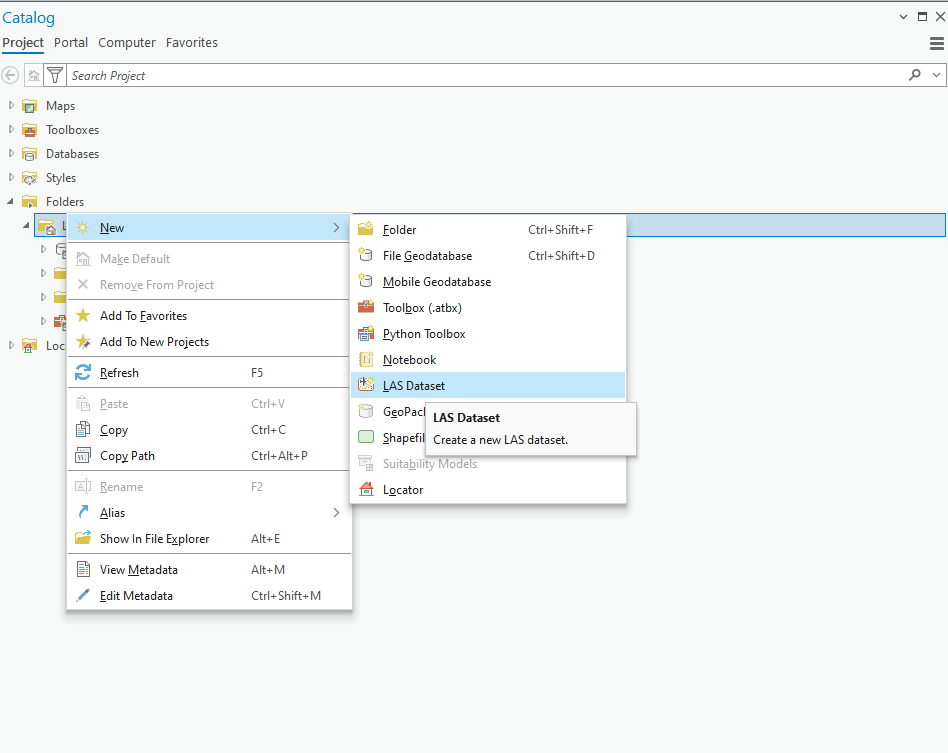
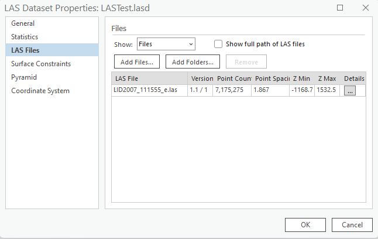
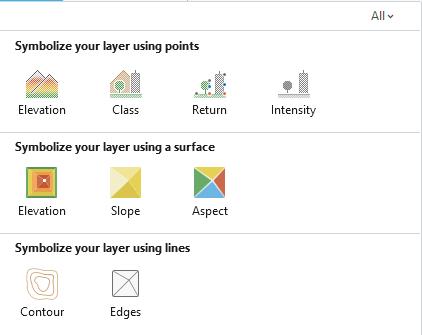
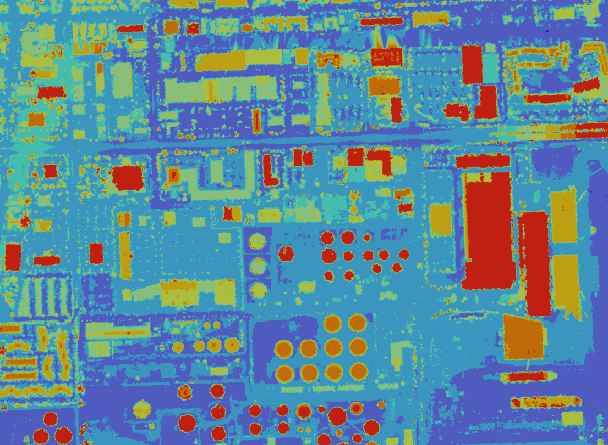
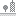
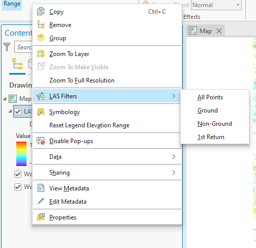
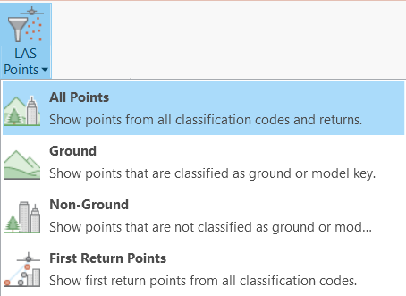
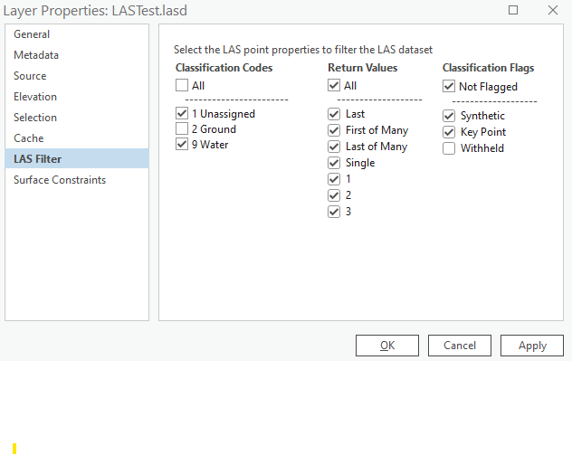

## Overview
This FloridaView laboratory is part of the **LiDAR Remote Sensing Learning Path**. It has been migrated from the original course document into a single Markdown source so the web tutorial and downloadable PDF can be updated together.

## Learning objectives
- Create an ArcGIS Pro LAS dataset from LAS files.
- Visualize and symbolize LiDAR by elevation and other point properties.
- Use LAS filters, statistics, and point-thinning controls.

## Prerequisites and software
- **Software:** ArcGIS Pro
- Review the [Software & Access](../software.md) page before starting.
- **Teaching data: not yet published.** The named course datasets are unavailable for public download. Check the [FloridaView Data](../data.md) page for availability; FAU students should use the dataset supplied by their instructor. Procedures that require these files cannot be completed from the website alone.

:::{note}
**FAU students:** use the submission template available from this page's download menu. Course-specific submission instructions may still be provided through your current FAU course environment.
:::

---

In this lab, you will learn ESRI ArcGIS Pro’s solution for lidar datasets and find relevant functions.

## Data
The named teaching dataset is not yet available for public download; see the [data availability notice](../data.md).

## Part 1: Create LAS Dataset

Lidar data, and optional surface constraints can be added to a LAS dataset directly. A LAS dataset is created using either the *Create LAS Dataset* geoprocessing tool or the folder context menu. A LAS dataset is not stored in the geodatabase, but rather a binary file created and stored on disk. Creating a LAS dataset is a quick process as it is a pointer to lidar LAS files and surface constraints stored on disk. The file extension to be generated is .lasd. Ensure that the LAS files to be used in the LAS dataset are all reasonably sized. A recommended file size is approximately 25 to 50 MB, and no larger than 100 MB for optimal performance. The LAS files should not contain more than three million points per file when used in a LAS dataset. There are two ways in which to create a LAS dataset: interactively through the context menu or through a geoprocessing tool. The following steps describe how to create a LAS dataset using the *context menu*.

- Start ArcGIS Pro and create a map project. You can name your lab project as LAS_lab3

- Start Catalog Pane under View, Right-click the folders where the LAS dataset is to be created

- From the context menu, click New \> LAS Dataset (**Figure 1**)

> 
>
> Figure 1 Creating a LAS Dataset in ArcGIS Pro.

- Rename the LAS dataset from **New Las Dataset** to an appropriate name (e.g. LASTest.lasd) for this lab

- Right-click the new LAS dataset to open the ***LAS Dataset Properties*** dialog box

- Select the **LAS Files** tab to add LAS files (**the corresponding FloridaView lab dataset**) to the LAS dataset. You can either select the **Add Files** button or the **Add Folder** button to add LAS files to the new LAS dataset. **Statistics** tab can calculate the statistics of the added LAS files (**Figure 2**).

- You can also remove any LAS files or surface constraints from the LAS dataset using the ***LAS Dataset Properties*** window using the **Remove** button on either tab

> 
>
> Figure 2 LAS Dataset Properties to add lidar las data file.

Optionally, you can also create a LAS dataset using Geoprocessing tool. Instructions can be found at: <https://pro.arcgis.com/en/pro-app/latest/help/data/las-dataset/create-a-las-datasets.htm>

## Part 2: Display and analyze LAS Dataset
Once a LAS dataset is created, this dataset can be added to ArcGIS Pro.

:::{image} ../../assets/labs/lidar/lab-03/fig-03-03.png
:alt: Add Data toolbar icon
:width: 24px
:::

ArcGIS Pro is context driven, which means that the options available to you are dependent on the type of data you have selected in the **Contents** pane. When you select a LAS dataset in the **Contents** pane, you see a **LAS Dataset Layer** tab set containing a **Data** tab and a **Classification** tab. The functionality on these tabs contains options that are only relevant to the LAS dataset layer. When multiple LAS datasets are selected, a limited set of functionalities is available. Display and analysis functionality can only be conducted on one LAS dataset layer at a time in ArcGIS Pro. From the **LAS Dataset Layer** tab set, you have access to the basic functionality you need to alter the display and LAS filter options of the LAS dataset. For more information about this tab, see [Change the symbology of a LAS dataset](https://pro.arcgis.com/en/pro-app/3.3/help/data/las-dataset/change-the-symbology-of-a-las-dataset.htm), [Change filter options for a LAS dataset](https://pro.arcgis.com/en/pro-app/3.3/help/data/las-dataset/change-filters-for-a-las-dataset.htm), and [Point thinning and scalability of a LAS dataset](https://pro.arcgis.com/en/pro-app/3.3/help/data/las-dataset/point-thinning-and-scalability-of-a-las-dataset.htm). These functions can be also accessed by Right-click the las dataset in Contents pane. Next, we will exercise some of these **LAS Dataset Layer** functions.

## LAS dataset symbology
Symbology function is under LAS Dataset Layer-\>Symbology (**Figure 3**). You have several options in terms of how you display or symbolize a LAS dataset. The display renderers only show one renderer at a time. To display more than one renderer for a LAS dataset, consider using the Symbology pane. Use the **Symbology** drop-down menu to quickly change the symbology of a LAS dataset between common point and surface symbology renderers. The appearance of the LAS dataset automatically changes with each selection from the **Symbology** drop-down menu.

**Figure 4** shows the Elevation of the las dataset you just created. If your data is not shown, you can zoom in it, and be patient. Lidar data is huge and difficult to display.

Figure 3 Symbology function in ArcGIS Pro for Las dataset.

Figure 4 Elevation of the created las dataset.

Select from any of the following point-based symbology renderers:

| Point symbology | Description |
|---|---|
|  Elevation | Color points by their elevation. |
|  Class | Color points by their LAS classification code. |
|  Return | Color points by laser-pulse return number. |
|  RGB | Use the RGB color values stored with each point. |
|  Intensity | Color points by return intensity. |

Select from the following surface-based symbology renderers:

| TIN surface symbology | Description |
|---|---|
|  Elevation | Color the triangulated surface by elevation. |
|  Aspect | Color the surface by slope direction. |
|  Slope | Color the surface by slope steepness. |

You can learn more about LAS dataset symbology at:

<https://pro.arcgis.com/en/pro-app/latest/help/data/las-dataset/change-the-symbology-of-a-las-dataset.htm>

## LAS Dataset Layer—Filter options
Every lidar point can have a [classification](https://pro.arcgis.com/en/pro-app/3.3/help/data/las-dataset/storing-lidar-data.htm#GUID-C2491A79-6C30-44CF-AC3F-ABEBBBE17A86) assigned to it that defines the type of object that has reflected the laser pulse. Lidar points can be classified into several categories including bare earth or ground, top of canopy, and water. The different classes are defined using numeric integer codes in the LAS files. Classification codes were defined by the American Society for Photogrammetry and Remote Sensing (ASPRS) for LAS formats 1.1, 1.2, 1.3, and 1.4. ArcGIS supports all versions of LAS. LAS version 1.4 is the latest LAS version and adds additional point classification and information.

The **Filters** group on the **LAS Dataset Layer** tab set allows you to change the display of the data contributing to the LAS dataset in ArcGIS Pro. A LAS dataset can reference many LAS files and surface constraints. You can adjust which lidar points and surface constraints are drawn using the **Filters** group. The **Filters** group contains **LAS Points** and **Surface Constraints** filters. The **LAS Points** and **Surface Constraints** buttons provide quick access to the LAS dataset **Layer Properties**. Once the filter options have been chosen, any further analysis or symbology changes will honor the selected filters. Follow these steps to access the LAS dataset **Filters** group.

- Select a LAS dataset layer in the **Contents** pane.

- On the **LAS Dataset Layer** tab set, in the **Filters** group, click the desired LAS dataset filter option or options (Figure 5).

Figure 5 Filter options for a LAS dataset in ArcGIS Pro.

- **Change LAS point filters:** A lidar pulse can be reflected from one or many features and can therefore return more than one laser pulse. You can use these separate laser pulse returns to display the lidar data referenced by the LAS dataset. The most common filters are Ground and Non-Ground, meaning ground laser returns and feature laser returns, respectively. Being able to separate out lidar data based on different laser returns allows you to analyze and visualize lidar data quickly and efficiently for various applications.

The **LAS Points** filters drop-down menu provides a quick way to access common lidar filters. There are several other options available in ArcGIS Pro to filter lidar data referenced by the LAS dataset. Use the **LAS Filters** on the **Layer Properties** for more advanced point filter options. Choose from any of the following lidar point filters:

| Point or surface filter | Description                                                                                |
|-------------------------|--------------------------------------------------------------------------------------------|
| All Points              | Use all the lidar points to display the LAS dataset.                                       |
| Ground                  | Use only the lidar points flagged as ground points to display the LAS dataset.             |
| Non-Ground              | Use all the lidar points that are not flagged as ground points to display the LAS dataset. |
| First Return            | Use only first-return lidar points to display the LAS dataset.                             |

An emitted laser pulse can have several returns depending on the features it is reflected from, and the capabilities of the laser scanner used to collect the data. The first return will be flagged as return number one, the second as return number two, and so on. The filters that are selected can be applied to the LAS dataset displayed either as points or as a surface. The **Classification Codes**, **Return Values**, and **Classification Flags** options can be used to filter the points for display and analysis.

Click the **LAS Points** button from the **Filters** group to open the **LAS Filters** on the **Layer Properties (**Figure 6**)**.

Click the appropriate check boxes to display the desired LAS dataset filter options.

Figure 6 LAS Filter options.

| Point filter | Description |
|---|---|
| **Classification Codes** | Every postprocessed LiDAR point can have a classification describing the type of object that reflected the laser pulse. Common classes include ground, vegetation, buildings, and water, represented by numeric LAS class codes. |
| **Return Values** | A laser pulse can produce multiple returns depending on the target and sensor. Returns are numbered in acquisition order, such as first return, second return, and so on. |
| **Classification Flags** | Flags provide secondary information in addition to the class code. LAS 1.1 and later support flags such as **Synthetic**, **Overlap**, **Key Point**, and **Withheld**, allowing a point to retain its class while carrying an additional status. |

More information of Change filter options for a LAS dataset can be found:

<https://pro.arcgis.com/en/pro-app/latest/help/data/las-dataset/change-filters-for-a-las-dataset.htm>

## LAS dataset statistics
The **LAS Dataset Properties** dialog box from the **Catalog** pane also allows you to calculate or update statistical information for the LAS dataset. This dialog box reports information about the LAS dataset, plus details about the specific LAS files that participate in the dataset.

If statistics were not generated using either the Create LAS Dataset or the LAS Dataset Statistics tool, you can calculate statistics interactively for a LAS dataset or individual LAS file using the **LAS Dataset Properties** dialog box.

The statistical results can be reviewed immediately for the LAS dataset through the **Statistics** tab of the **LAS Dataset Properties** dialog box. For individual LAS files, the statistics can be reviewed by clicking the **Details** button for that LAS file located on the **LAS Files** tab. The **LAS Dataset Properties** dialog box cannot be used to export the statistics to a text file; use the LAS Dataset Statistics tool to create an output report.

:::{image} ../../assets/labs/lidar/lab-03/fig-03-17.png
:alt: LAS dataset icon in the Catalog pane
:width: 24px
:::

Click the **Statistics** tab on the **LAS Dataset Properties** dialog box.

If the LAS dataset has not had statistics calculated, click the **Update** button to calculate statistics. If the LAS dataset has already had statistics calculated, click the **Update** button to update statistics. This button is unavailable if statistics are up to date.

More information of LAS statistics can be found at:

<https://pro.arcgis.com/en/pro-app/latest/help/data/las-dataset/work-with-las-dataset-statistics.htm>

## Point thinning and scalability of a LAS dataset
You can also exercise **Point Thinning** function to display lidar data more efficiently.

<https://pro.arcgis.com/en/pro-app/latest/help/data/las-dataset/point-thinning-and-scalability-of-a-las-dataset.htm>

ESRI provides a tutorial:

Create and visualize a lidar point cloud

<https://learn.arcgis.com/en/projects/create-and-visualize-a-lidar-point-cloud/>

You are strongly encouraged to run this tutorial to strengthen your knowledge of lidar and LAS functions.

**Assignment 1 (4 points)**

1)  How many points are there in the sample LAS data (LID2007_111555_e.las)? (hint: can be found in las **Catalog** pane)

Number of points: \_\_\_\_\_\_

2)  What are the minimum and maximum elevations in this LAS data? (hint: can be found in las **Catalog** pane)

Minimum elevations: \_\_\_\_\_\_\_\_\_\_m

Maximum elevations: \_\_\_\_\_\_\_\_\_\_\_m

3)  How many ground points in this LAS data? (Hint: can be found in las **Catalog** pane)

Number of ground points: \_\_\_\_\_\_\_\_\_\_

**Assignment 2 (6 points)**

Make a map of the Digital Terrain Model (DTM) from the las dataset you created and get the screenshot of your map and paste it here (you can use the windows Snipping Tool to get a better screenshot; use Symbology, and filter options to get DTM). Do not forget map components like north arrow and scale bar.

If you do not know how to make a map layout, watch: <https://www.youtube.com/watch?v=EhE55ZtrJlk&list=PLGZUzt4E4O2IJFxX_Bhp98MJEw5ItRtvb&index=11>

Submit your assignment using the provided template in PDF.
