## Overview
This FloridaView laboratory is part of the **LiDAR Remote Sensing Learning Path**. It has been migrated from the original course document into a single Markdown source so the web tutorial and downloadable PDF can be updated together.

## Learning objectives
- Classify ground, noise, buildings, and vegetation in a LiDAR point cloud.
- Refine automated classes with manual classification tools.
- Generate a DEM from classified ground points.

## Prerequisites and software
- **Software:** ArcGIS Pro
- Review the [Software & Access](../software.md) page before starting.
- **Teaching data: not yet published.** The named course datasets are unavailable for public download. Check the [FloridaView Data](../data.md) page for availability; FAU students should use the dataset supplied by their instructor. Procedures that require these files cannot be completed from the website alone.

:::{note}
**FAU students:** use the submission template available from this page's download menu. Course-specific submission instructions may still be provided through your current FAU course environment.
:::

---

This lab will teach you how to classify lidar points into ground, buildings, vegetation and noise in ArcGIS Pro.

## Background
The City of Copenhagen, Denmark, is redeveloping the district of Tuborg Havn, and they want to use a lidar point cloud for modeling the neighborhood in 3D. This will support further urban planning activities. In this tutorial, as a remote sensing analyst for the city, you will classify lidar cloud points representing the ground, buildings, vegetation, or noise. You will also learn to filter the points based on their assigned class for visualization and processing. Classifying a point cloud is a key step to support many workflows, such as creating elevation rasters or extracting 3D buildings and trees and help better communicate what the world around us looks like.

## Data
*This tutorial was last tested on August 12, 2026, using ArcGIS Pro 3.7. If you're using a different version of ArcGIS Pro, you may encounter different functionality and results.*

## Download and open the project
1.  Download/copy the Tuborg_Havn_LAS_Classification file to your own working folder.

2.  Locate the file on your working folder.

3.  Open the extracted Tuborg_Havn_LAS_Classification folder. Double-click **Tuborg_Havn_LAS_Classification.aprx** to open the project in ArcGIS Pro.

4.  The project opens.

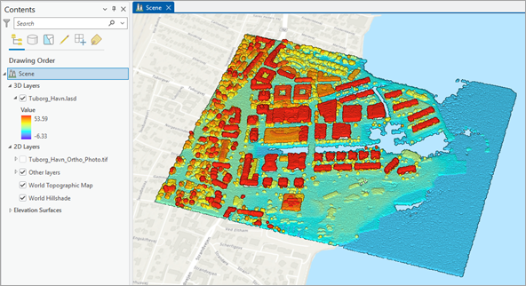

The project contains a 3D-enabled local scene centered on the neighborhood of Tuborg Havn in Copenhagen, Denmark. The scene contains **Tuborg_Havn.lasd**, a lidar point cloud dataset in the LAS format. For now, the point cloud is symbolized by elevation, with the lowest point in blue and the higher points in red.

## Learn about classifying point cloud datasets
You'll classify the points in the LAS dataset into several categories, such as ground, buildings, vegetation, and noise, using a combination of automated and manual techniques. The process begins with a series of [Automated Classification](https://pro.arcgis.com/en/pro-app/latest/help/data/las-dataset/rule-based-classification-techniques.htm) tools. These tools use rule-based algorithms to evaluate factors like elevation, return number, and point density, with the goal of inferring the most likely class for each point.

For example, ground points are typically identified based on their low elevation and smooth continuity, while building points may be recognized by their flat, elevated surfaces and sharp edges. Vegetation points often show irregular vertical structures and multiple returns, and noise points are flagged based on inconsistencies or anomalies identified in the data.

Later in the workflow, you'll refine the classification by [manually adjusting point classes](https://pro.arcgis.com/en/pro-app/latest/help/data/las-dataset/interactive-las-class-code-editing.htm) where the automated tools may have misclassified or missed subtle features. This hybrid approach ensures both efficiency and accuracy in producing a well-structured point cloud dataset.

Note:

Often lidar point clouds are already classified by their provider. In such cases, you don't need to do the classification yourself, unless you want to improve it. However, it is always useful to become familiar with the principles of lidar point cloud classification, which is one of the goals of this tutorial.

## Adjust the LAS dataset display
Before starting the classification, you will make a few adjustments to optimize the performance and the symbology settings. First, you will recompute the [LAS dataset pyramid](https://pro.arcgis.com/en/pro-app/latest/help/data/las-dataset/las-dataset-pyramids.htm) to ensure they are up to date. A LAS dataset pyramid structure is used to improve the 3D display performance.

1.  In the **Command Search** box at the top of the screen, type Build LAS Dataset Pyramid, press Enter, and choose **Build LAS Dataset Pyramid (Data Management)**.

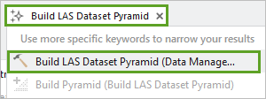

2.  In the **Build LAS Dataset Pyramid** tool pane, for **Input LAS Dataset**, choose **Tuborg_Havn.lasd** and press **Run**.

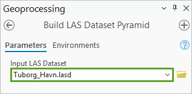

Next, you will change the symbology settings to visualize the LAS point classes.

3.  In the **Contents** pane, click the **Tuborg_Havn.lasd** layer to select it.

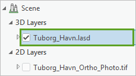

4.  On the ribbon, click the **LAS Dataset Layer** tab. In the **Drawing** group, click the **Symbology** down arrow and choose **Class**.

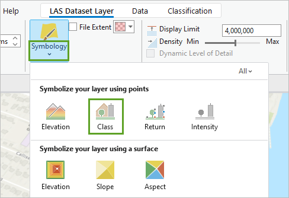

The symbology now shows the classification of each point. Because they are currently all unassigned, they are all symbolized in gray.

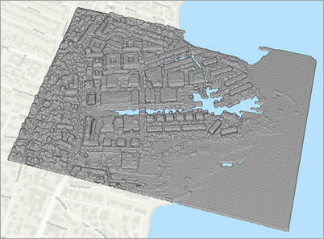

In the **Contents** pane, a list of possible classes appears, but most of them are not currently in use in the LAS dataset.

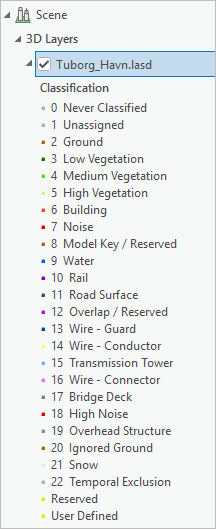

5.  Click the arrow next to **Tuborg_Havn.lasd** to collapse the legend and declutter the **Contents** pane.

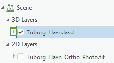

Note:

A LAS dataset is often made of several individual LAS files. In some cases, these files overlap each other in some locations due to the original flight lines of the aircraft that created the data. Because the duplicate points can create noise, you should first identify them using the [Classify LAS Overlap](https://pro.arcgis.com/en/pro-app/latest/tool-reference/3d-analyst/classify-las-overlap.htm) tool and then turn them off. However, in the current data, there is no overlap, so this process is not needed. Learn more about [overlap classification](https://pro.arcgis.com/en/pro-app/latest/tool-reference/3d-analyst/classify-las-overlap.htm).

Next, you'll classify the ground points.

## Classify ground and noise points
You'll start by classifying the points that represent the ground surface. These are usually the lowest elevation points, and they create the foundation for further analysis. At the same time, you'll identify noise points that appear abnormally high or low and are probably artifacts caused by random errors in the lidar data collection process. Sometimes these are caused by birds or steam in the air, or you may decide that a group of points should be set as noise based on your own judgment, such as at a construction site.

1.  On the ribbon, click the **Classification** tab. In the **Geoprocessing** group, click **Automated Classification** and review the content of the drop-down list.

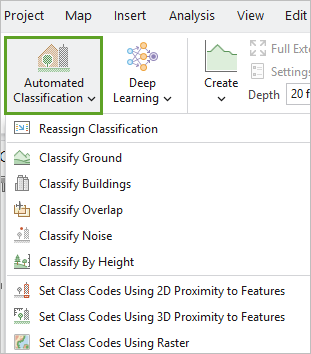

The **Automated Classification** drop-down list is a convenient place to access most of the classification tools you'll use in this tutorial.

2.  In the **Automated Classification** drop-down list, choose **Classify Ground**.

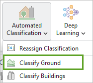

In the **Geoprocessing** pane, the [Classify LAS Ground](https://pro.arcgis.com/en/pro-app/latest/tool-reference/3d-analyst/classify-las-ground.htm) tool appears.

3.  In the **Classify LAS Ground** tool pane, for **Input LAS Dataset**, confirm that **Tuborg_Havn.lasd** is selected.

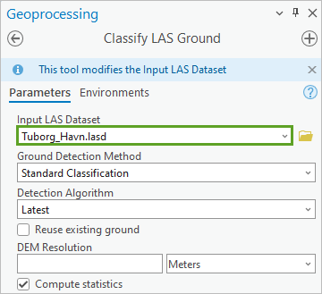

This tool also contains options to classify the noise points. Noise points are points that are abnormally high or low.

4.  Click the arrow next to **Noise Classification** to expand that section.

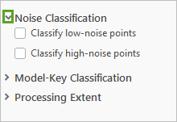

5.  Check the **Classify low-noise points** box. For **Minimum Depth Below Ground**, type 2.

This means that any points located more than 2 meters below ground will be classified as low noise.

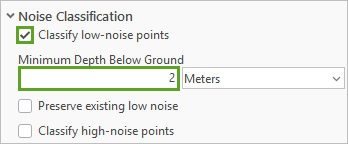

6.  Check the **Classify high-noise points** box. For **Minimum Height Above Ground**, type 42.

Any points situated higher than 42 meters above the ground will be classified as high noise.

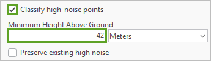

Note:

The buildings in the Tuborg neighborhood have a maximum height of around 40 meters, which is why you are selecting 42 meters as the maximum value. You can confirm this by exploring the LAS point cloud. To determine a building's maximum height, zoom in and click on the highest point visible. A pop-up window will display the elevation of that point in meters.

7.  Accept the default values for the other parameters and click **Run**.

Note:

Ground classification is a crucial first step in processing aerial lidar data. It involves identifying and labeling points in a point cloud that represent the bare earth surface. This step is essential because many valuable lidar-derived products, such as Digital Elevation Models (DEMs), depend on accurately classified ground points. Moreover, ground classification lays the foundation for identifying other features, such as buildings and vegetation. These classifications rely on knowing the height of a point relative to the ground, making ground classification a prerequisite.

To identify all the ground points in the LAS point cloud, the **Classify LAS Ground** tool uses techniques such as finding the sets of points that are consistently the lowest throughout the scene. Learn more about this topic on the [Understand ground classification](https://pro.arcgis.com/en/pro-app/latest/help/analysis/3d-analyst/ground-classification.htm) page.

When the process is complete, the LAS ground points appear in brown in the scene. The few points classified as noise (high or low) appear in red. The points in gray are still unassigned.

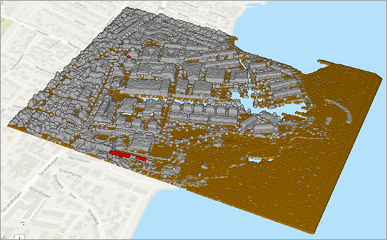

You'll compare this classification to the provided orthophoto using the **Swipe** tool.

8.  In the **Contents** pane, click the check box next to **Tuborg_Havn_Ortho_Photo.tif** to turn on the layer. Confirm that **Tuborg_Havn.lasd** is selected.

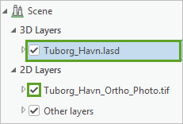

9.  On the ribbon, on the **LAS Dataset Layer** tab, in the **Compare** group, click **Swipe**.

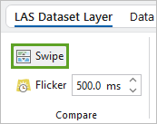

10. On the scene, drag the swipe handle repeatedly from top to bottom to peel off the point cloud and reveal the orthophoto.

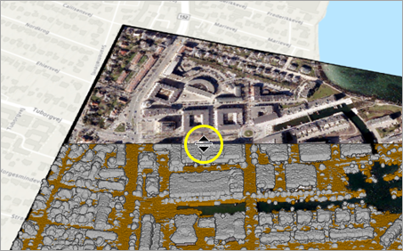

Observe how the brown points match the ground and the gray points—still unclassified—are located on buildings, vegetation, cars, or boats. Note that the southeast section of the neighborhood is still under construction. Some points located on water bodies were classified as ground. However, in this workflow, you don't need to distinguish solid ground from water, so all is considered as ground.

Note:

Since the point cloud is a 3D representation and the orthophoto is a 2D image, they are acquired differently. Lidar usually gathers data directly overhead using laser pulses, while imagery is captured from cameras at various angles. When viewed in a 3D scene, this difference in acquisition geometry can make buildings and other features appear misaligned between the two layers, even though the data is correct.

11. When you are finished comparing the two layers, on the ribbon, on the **Map** tab, in the **Navigate** group, click the **Explore** button to exit the swipe mode.

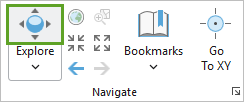

You'll save your project.

12. In the **Quick Access Toolbar**, click the **Save Project** button.

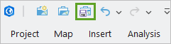

## Filter classified points
Next, you'll review some of the point classes separately using the **LAS Filter** capability.

1.  If necessary, in the **Contents** pane, click the **Tuborg_Havn.lasd** layer to select it.

2.  On the ribbon, on the **LAS Dataset Layer** tab, in the **Filters** group, click the **LAS Points** button.

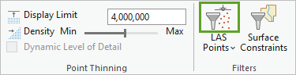

The **Layer Properties** window appears set to the **LAS Filter** tab. In the **Classification Codes** column, you can see that the current classes are **Unassigned**, **Ground**, (low) **Noise**, and **High Noise**. They correspond to the codes **1**, **2**, **7**, and **18**, respectively.

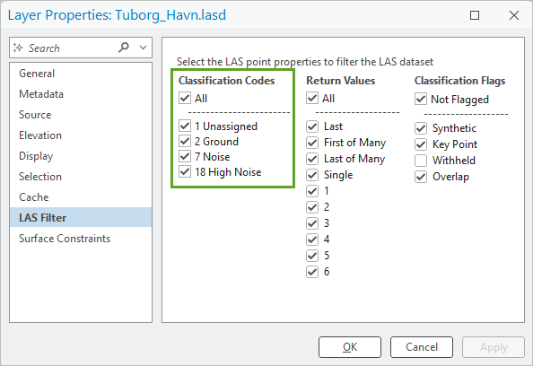

The LAS Filter allows you to choose the categories of points you want to display or hide from view. For now, all four classes are turned on. You will now visualize only the **High Noise** points.

3.  Uncheck the boxes for **1 Unassigned**, **2 Ground**, and **7 Noise**. Click **OK**.

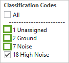

4.  With the mouse wheel, zoom in to the lower part of the extent where some **High Noise** points are located, symbolized in red.

You can see from the orthophoto that this location is within the construction zone, and the high noise likely corresponds to the presence of two construction cranes.

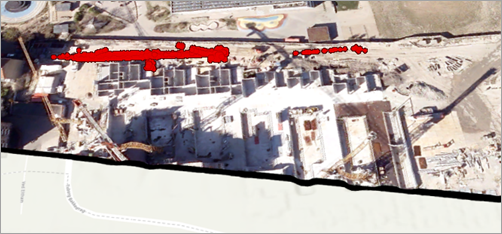

Next, you'll look at the (low) **Noise** points.

5.  On the ribbon, on the **LAS Dataset Layer** tab, click the **LAS Points** button. In the **Layer Properties** window, turn off **18 High Noise** and turn on **7 Noise**. Click **OK**.

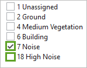

6.  In the **Contents** pane, turn off the **Tuborg_Havn_Ortho_Photo.tif** layer.

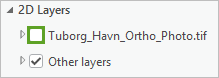

7.  Zoom out until you see some of the few low noise points, also symbolized in red.

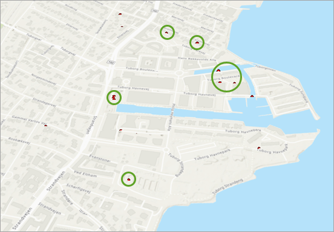

Note:

Noise can also be classified independently from the ground by choosing **Classify Noise** in the **Automated Classification** drop-down list. This will open the [Classify LAS Noise](https://pro.arcgis.com/en/pro-app/latest/tool-reference/3d-analyst/classify-las-noise.htm) tool.

You'll turn off the noise points for the rest of the workflow, since those are points you want to ignore, and you'll turn back on ground and unassigned points.

8.  In the **Contents** pane, select the **Tuborg_Havn.lasd** layer. On the ribbon, on the **LAS Dataset Layer** tab, click the **LAS Points** button. In the **Layer Properties** window, turn off **7 Noise** and turn on **1 Unassigned** and **2 Ground**. Click **OK**.

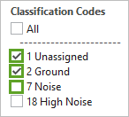

Note:

When you classify LAS points, the original dataset is updated with new class codes. If you made a mistake and need to revert a change, on the **Automated Classification** drop-down menu, choose **Reassign Classification**, and run the [Change LAS Class Codes](https://pro.arcgis.com/en/pro-app/latest/tool-reference/3d-analyst/change-las-class-codes.htm) tool.

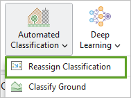

For instance, you could change the points with the **Current Class** 2 values (Ground) to the **New Class** 1 value (Unassigned). If you type -1 as the **Current Class** value, all class codes will be reassigned.

## Classify building points
Now that you've classified ground and noise points, you'll classify the building points.

1.  If necessary, in the **Contents** pane, select the **Tuborg_Havn.lasd** layer.

2.  On the ribbon, on the **Classification** tab, click **Automated Classification** and choose **Classify Buildings**.

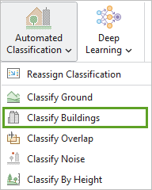

In the **Geoprocessing** pane, the [Classify LAS Building](https://pro.arcgis.com/en/pro-app/latest/tool-reference/3d-analyst/classify-las-building.htm) tool appears.

3.  In the **Classify LAS Building** tool pane, set the following parameters:

    - For **Input LAS Dataset**, confirm that **Tuborg_Havn.lasd** is selected.

    - For **Minimum Rooftop Height**, confirm that it is set to **2** with the units set to **Meters**.

    - For **Minimum Area**, type 10 and confirm the unit is set to **Square Meters**.

    - For **Classification Method**, choose **Aggressive**.

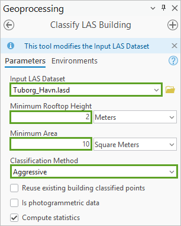

The **Minimum Rooftop Height** and **Minimum Area** parameters are important to make sure that a surface that is too low or too small in area is not mistakenly classified as a building.

The **Classification Method** value specifies whether points are categorized as buildings more conservatively or more aggressively.

In this tutorial, the parameter values were chosen by trial and error to get the maximum number of points classified correctly as buildings, while minimizing the false positives. You can experiment further on your own.

4.  Expand **Above-Roof Classification** and check the **Classify points above the roof** box. For **Maximum Height Above Roof**, type 15.

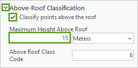

That means any points above the roofs of detected buildings will also be assigned the Building class (code **6**), as long as they're no more than 15 meters above the roof. This helps properly assign elements like chimneys, HVAC units, or steeples.

5.  Expand **Below-Roof Classification** and check the **Classify points below the roof** box.

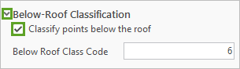

This means that any points below the detected roofs will also be assigned the Building class (code **6**). This is useful to include vertical building sides (walls and windows) in the building classification.

6.  Click **Run**.

Note:

The **Classify LAS Building** tool uses multiple detection methods to identify building points. Before running the tool, it is crucial to separate ground points and noise points. For the remaining unclassified points, which are not labeled as ground or noise, the tool searches for solid surfaces that produced only a single return per laser pulse. These are likely to be buildings. In contrast, areas with multiple returns typically indicate trees or vegetation, as the laser reflects off several levels within the foliage.

7.  When the process is complete, on the ribbon, on the **LAS Dataset Layer** tab, click **LAS Points**. In the **Layer Properties** window, under **Classification Codes**, turn on the **6 Building** class and click **OK**.

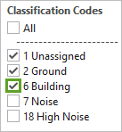

The building points appear on the scene, symbolized in red, along with the ground and still unassigned points.

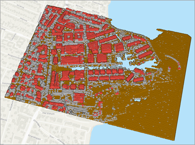

8.  Press Ctrl+S to save the project.

## Perform manual classification
Some of the buildings have been incorrectly classified. A few remaining unassigned points on the roof or edges of a building are acceptable. However, if an entire piece of the building is missing, that can be fixed by performing manual classification. You'll do that on one building.

1.  Zoom in to the large building in the center left of the scene.

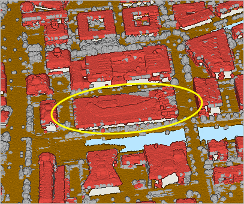

2.  Ensure the navigation wheel is expanded, and drag the middle wheel down, until you see the lidar point cloud completely from above (nadir).

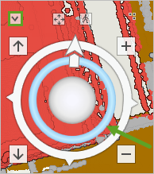

3.  If necessary, zoom in further to ensure the building takes up a large portion of the scene.

You can see that some parts of the building were not classified properly, and the points are still unassigned.

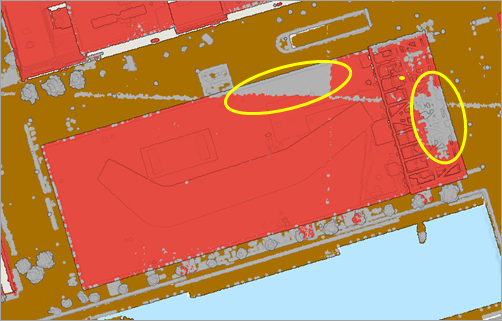

You want to reclassify these unassigned points manually, but you want to make sure that the ground points can't mistakenly be reclassified as buildings.

4.  On the ribbon, on the **Classification** tab, in the **Selection** group, click **Selectable Points**.

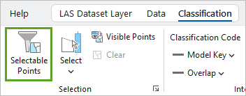

5.  In the **Layer Properties** window, uncheck all the boxes to keep only **1 Unassigned** and **6 Building** checked. Click **OK**.

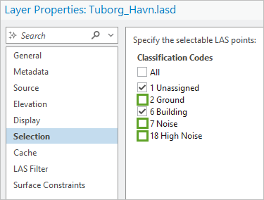

Only **Unassigned** and **Building** points can now be changed.

6.  On the ribbon, on the **Classification** tab, turn off the **Visible Points** option (its background should be white, not gray).

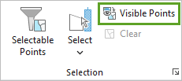

This will ensure that all the points in the area you select will be processed. You will now trace your desired selection as a polygon.

7.  On the ribbon, on the **Classification** tab, click the **Select** down arrow and choose **Polygon**.

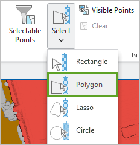

8.  Click one of the corners of the building, and continue tracing the building footprint, clicking each of its corners or angles. Double-click the last corner (8) to complete the polygon.

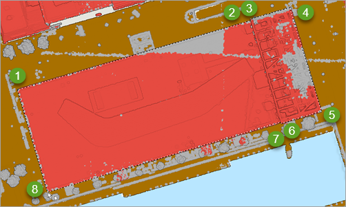

All the points within the building footprint are now highlighted in cyan.

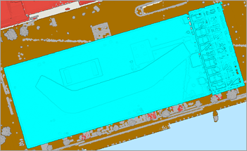

Next, you'll reclassify these points.

9.  On the **Classification** tab, in the **Interactive Editing** group, for **Classification Code**, choose **6 Building**. Click **Apply Changes**.

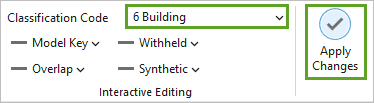

The building is now correctly classified in its entirety.

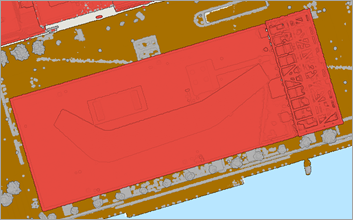

While you could choose to improve other buildings, for this tutorial, you'll stop here.

10. In the **Contents** pane, right-click **Tuborg_Havn.lasd**, and choose **Zoom To Layer**.

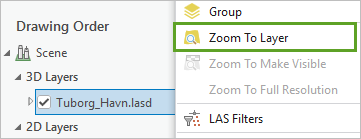

11. On the ribbon, on the **Map** tab, click the **Explore** button to exit the polygon selection mode.

After points are classified manually in a LAS dataset, the associated statistics are not updated to reflect the new class codes. To ensure the statistics accurately represent the current data, it's recommended that you recalculate them using the [LAS Dataset Statistics](https://pro.arcgis.com/en/pro-app/latest/help/data/las-dataset/work-with-las-dataset-statistics.htm) tool. This step helps maintain data integrity and supports reliable analysis and visualization of data.

12. In the **Geoprocessing** pane, click the back button.

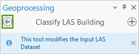

13. In the search box, type LAS Dataset Statistics. In the list of results, click **LAS Dataset Statistics** to open the tool.

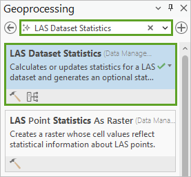

14. In the **LAS Dataset Statistics** tool pane, for **Input LAS Dataset**, choose **Tuborg_Havn.lasd**, and click **Run**.

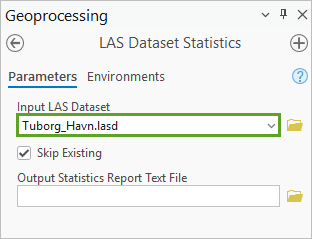

15. Press Ctrl+S to save the project.

Once ground and building points are classified and noise has been removed, your dataset is ready for various outputs and analyses. For example, you can generate elevation products such as a Digital Terrain Model (DTM) and a Digital Surface Model (DSM). You can also create a 2D building footprint polygon layer and a 3D building layer for use in future projects. These workflows will be demonstrated in upcoming tutorials.

## Classify vegetation
After ground and building points are classified and noise is removed, some points in the dataset remain unassigned. Some of these likely represent vegetation, such as trees, shrubs, and other plant life. However, not all unassigned points are vegetation. Some may be vehicles, street-level features, or small architectural details like roof edges and building trim. Accurately identifying vegetation while avoiding false positives is crucial for creating reliable elevation models and feature layers.

There are several ways to classify vegetation in point cloud data, each with its own advantages depending on the dataset's characteristics. In this tutorial, you'll examine one effective method. The process starts by analyzing the remaining unassigned points to understand their spatial patterns. This initial analysis helps differentiate vegetation from other features and prepares for applying classification techniques that more accurately isolate vegetation. First, you'll observe the remaining unassigned points.

1.  In the scene, review where some of the unassigned points (in gray) are located.

In the following example image, you can see that there are several trees (larger gray lumps) that you want to classify as vegetation. You can also see some unassigned points that are on the buildings or very close to them: these are not vegetation and should not be classified as such.

You'll use a 2D building footprint layer to identify the unassigned points that are on the buildings or very close to them. You'll assign these points to a separate class to set them aside. First, you'll display only the unassigned points, which are the only points you want to be processed.

2.  If necessary, in the **Contents** pane, select the **Tuborg_Havn.lasd** layer. On the ribbon, on the **LAS Dataset Layer** tab, click the **LAS Points** button. In the **Layer Properties** window, turn off all classes except **1 Unassigned**. Click **OK**.

You'll turn on the 2D building footprint layer.

3.  In the **Contents** pane, expand the **Other layers** group, and turn on the **Building_footprints** layer.

The **Building_footprints** layer (light orange) appears in the scene along with the unassigned points.

Note:

The **Building_footprints** layer was generated from point cloud data classified as class code **6** (Building). This workflow will be demonstrated in a future tutorial. Alternatively, building footprints can be extracted from imagery using GeoAI techniques, as demonstrated in the tutorials [Identify infrastructure at risk of landslides](https://learn.arcgis.com/en/projects/identify-infrastructure-at-risk-of-landslides/arcgis-pro/) and [Improve a deep learning model with transfer learning](https://learn.arcgis.com/en/projects/improve-a-deep-learning-model-with-transfer-learning/). Another option is to use an existing building footprint layer provided by your organization or local municipality.

4.  In the **Contents** pane, if necessary, select **Tuborg_Havn.lasd**. On the ribbon, on the **Classification** tab, click **Automated Classification**, and choose **Set Class Codes Using 2D Proximity to Features**.

In the **Geoprocessing** pane, the [Set LAS Class Codes Using Features](https://pro.arcgis.com/en/pro-app/latest/tool-reference/3d-analyst/set-las-class-codes-using-features.htm) tool appears.

5.  In the **Set LAS Codes Using Features** tool pane, set the following parameters:

    - For **Input LAS Dataset**, confirm that **Tuborg_Havn.lasd** is selected.

    - For **Features**, choose **Other layers\Building_footprints**.

    - For **Buffer Distance**, type 0.

    - For **New Class**, type 100.

The tool will catch the remaining unassigned that coincide with the building footprints and assign them to the class **100**. Classes 64 to 255 are user defined, which means that you can use any of these classes for any purpose. In this case, you'll use class **100** to set aside the points that the tool will identify.

6.  Accept all other default values and click **Run**.

Note:

The **Set LAS Class Codes Using Features** tool had an issue in ArcGIS Pro 3.6. It works correctly in ArcGIS Pro 3.5 (and under) and in ArcGIS Pro 3.7.

If you are currently running ArcGIS Pro 3.6, you are strongly encouraged to update to 3.7. If you can't update, don't run the tool and skip directly to step 9 lower in the tutorial. The final result you'll obtain will be of slightly lower quality, but still acceptable.

7.  When the process is complete, on the ribbon, on the **LAS Dataset Layer** tab, click the **LAS Points** button, turn on **100 User Defined**, and click **OK**.

On the scene, observe how the points on or near buildings are now classified as **100 User Defined** (yellow).

Note:

You might be tempted to reclassify these **100 User Defined** points as **6 Buildings**. However, these points are a mix of building and non building points. So, it is better to keep them aside.

You will now classify the remaining unassigned points as vegetation based on their height. First, you'll turn off the **100 User Defined** points, so that they aren't processed.

8.  On the ribbon, on the **LAS Dataset Layer** tab, click the **LAS Points** button, turn off **100 User Defined**, and click **OK**.

9.  On the ribbon, on the **Classification** tab, click **Automated Classification** and choose **Classify By Height**.

The [Classify LAS By Height](https://pro.arcgis.com/en/pro-app/latest/tool-reference/3d-analyst/classify-las-by-height.htm) tool appears.

10. In the **Classify LAS By Height** tool pane, set the following parameters:

    - For **Input LAS Dataset**, confirm that **Tuborg_Havn.lasd** is selected.

    - Under **Height Classification**, type the following values.

| Class Code | Height |
|------------|--------|
| 101        | 3      |
| 4          | 22     |
| 18         | 100    |

12. The tool will take the remaining unassigned points and will classify them in the following manner:

    - Points under 3 meters high will be classified as **101 User Defined** because low points were not found to correspond reliably to vegetation. Like class **100** earlier, **101** is another user-defined class that can be used to set these points aside.

    - Points between 3 and 22 meters high will be classified as **4 Medium Vegetation**, as this is the height for most trees in the extent.

    - Points between 22 to 100 meters high will be classified as **18 High Noise**, as they are higher than any trees in the extent and can be considered as noise.

These numbers were chosen by clicking various tree points to see their **Elevation** value, as well as by trial and error.

Note:

There are three common vegetation classes: **3 Low Vegetation**, **4 Medium Vegetation**, and **5 High Vegetation**. Using all three classes is most suitable for forested landscapes. Urban areas like Tuborg Havn might benefit from using only one or two of these classes.

There are additional methods to further enhance vegetation classification. For example, you could use spectral imagery to pinpoint areas with vegetation and create a polygon layer that identifies these regions (see [Extract high-resolution land cover with GeoAI](https://learn.arcgis.com/en/projects/extract-high-resolution-land-cover-with-geoai/)). You would then apply that polygon vector layer as a mask in the **Classify LAS By Height** tool (located under **Processing Boundary**, which is under **Processing Extent**).

13. Click **Run**.

14. When the process is complete, on the ribbon, on the **LAS Dataset Layer** tab, click the **LAS Points** button, turn on **2 Ground**, **4 Medium Vegetation**, and **6 Building**, turn off all other classes, and click **OK**.

15. In the **Contents** pane, turn off **Building_footprints**.

You can now see the point cloud classified as ground, buildings, and vegetation.

The trees have been classified with a minimal number of false positives. In the southern area, there are a few false positives due to the construction site. Optionally, you could use the manual classification process to reclassify them.

Note:

In this workflow, you don't need to distinguish between solid ground and water unless your post-classification analysis specifically requires it. However, if you want to classify water, you can use a polygon vector layer representing water bodies. Using the [Set LAS Codes Using Features](https://pro.arcgis.com/en/pro-app/latest/tool-reference/3d-analyst/set-las-class-codes-using-features.htm) tool, you can assign class code **9** (Water) to all points within those polygons.

If you want to see more details, you can adjust the symbology to make the LAS points display smaller.

16. On the ribbon, on the **LAS Dataset Layer** tab, in the **Drawing** group, click the **Symbology** button.

17. In the **Symbology** pane, for **Symbol size**, type 60.

The points are now displayed at **60%** of their default size. The point cloud becomes crisper, showing the buildings and other features more sharply.

18. Press Ctrl+S to save the project.

In this tutorial, you used automated classification tools to categorize lidar point cloud data into five classes: ground, building, vegetation, (low) noise, and high noise. You also learned how to filter points by class code to support visualization and further processing. In addition to automated methods, you practiced classifying points manually and using a 2D polygon layer to assign class codes. Your classified point cloud can now support a variety of workflows—such as generating elevation rasters (DTM and DSM), extracting 2D building footprints, or creating 3D layers for buildings and trees.

While this workflow focused on standard classification techniques, more advanced methods are available. For example, GeoAI deep learning models can be used to classify complex features, such as power lines or vegetation, with greater precision. To explore this, check out the [Classify power lines using deep learning](https://learn.arcgis.com/en/projects/classify-powerlines-from-lidar-point-clouds/) tutorial.

## Generate a DEM
Now you have classified the points into ground and others. You can use the classified ground points to create a Digital Elevation Model (DEM) which is the bare earth and contains only the topography.

- Right click the las dataset in Contents- \> LAS Filters -\> Ground

- In Geoprocessing, find [LAS Dataset To Raster](https://pro.arcgis.com/en/pro-app/3.5/tool-reference/conversion/las-dataset-to-raster.htm)

- Set up the output DEM, such as Tuborg_DEM.tif to your working folder.

## Assignments
1.  Create a map of your final classified point cloud (4 points)

2.  Create a map of your generated DEM of the project area (5 points).

An example of testing results is shown below.

Classified lidar points and DEM created from the classified ground points.

Lab references: <https://learn.arcgis.com/en/projects/classify-a-lidar-point-cloud/>
