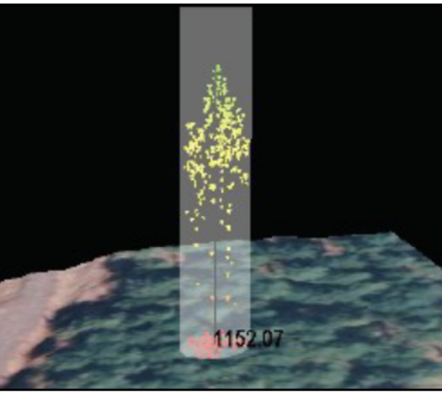

## Overview
This FloridaView laboratory is part of the **LiDAR Remote Sensing Learning Path**. It has been migrated from the original course document into a single Markdown source so the web tutorial and downloadable PDF can be updated together.

## Learning objectives
- Use FUSION/LDV measurement tools to isolate individual trees.
- Measure tree-top and ground elevations to estimate tree height.
- Record multiple tree measurements for analysis.

## Prerequisites and software
- **Software:** FUSION/LDV
- Review the [Software & Access](../software.md) page before starting.
- **Teaching data: not yet published.** The named course datasets are unavailable for public download. Check the [FloridaView Data](../data.md) page for availability; FAU students should use the dataset supplied by their instructor. Procedures that require these files cannot be completed from the website alone.

:::{note}
**FAU students:** use the submission template available from this page's download menu. Course-specific submission instructions may still be provided through your current FAU course environment.
:::

---

In this lab, you will use the fully-prepared example data to learn how to make tree measurements in FUSION/LDV.

## Data
**the corresponding FloridaView lab dataset**

## Part 1: Loading Data in FUSION
You have learned how to load data including raw lidar data and base imagery in FUSION. Start FUSION, and load in the **orthophoto_4800K.jpg** as your base imagery, raw lidar data **lda_4800K_data.lda**, and your bare earth model **4800K_ground_surface.dtm**. Save your project as lab05.dvz.

## Part 2: Make basic measurements in the LDV
1.  In your project lab05.dvz, select a stroked box sample that includes trees.

2.  Type, Alt+u to display the bare earth model and Type, Alt+i to display the orthophoto on the surface model or access these options from the right-click menu. You are now able to visualize lidar points within the measurement cylinder and view the corresponding area of the orthophoto.

3.  Right Click in the LDV window to activate the pop-up menu and Select, Measurement marker. This will change the display to an overhead view and show the measurement cylinder.

4.  Move the cylinder by holding down the Shift key and typing with the arrow keys. Move the cylinder so that an individual tree is at its center.

5.  Resize the measurement cylinder (Ctrl+Shift+Right mouse button + mouse drag up/down) to isolate the crown of a single tree.

6.  Click and drag the data cloud with the LMB (Left Mouse Button) to view the cylinder from the side.

7.  Type **h** to automatically move the cylinder to the highest lidar point. The value of the measurement marker location is displayed in the LDV’s window.

8.  To measure the ground elevation of this location, Type **g** to automatically move the cylinder to lidar points corresponding to the ground surface.

9.  You can now calculate this tree’s height by simply subtracting the ground elevation from the tree-top elevation.

Another method to make similar measurements is to automatically subtract the ground elevations, let’s do that now...

1.  Type Alt+i to turn the display of the orthophoto off.

2.  Likewise, Type Alt+u to turn the display of the bare earth model off (or turn these options off from the right-click menu).

3.  Return to the Fusion window and Click the Sample Options button.

4.  Enable the Subtract ground elevations from each return option and Click, OK.

5.  Click the Repeat last sample button.

6.  Notice that the sample area is “flat” in LDV and the elevation bar to the left is providing Height above ground.

7.  Right Click in the LDV window to activate the pop-up menu and Select, Image plate (Alt-p) to turn the orthophoto on below the lidar data (you may have to zoom-out to see the image plate if you are zoomed-in).

8.  Right Click in the LDV window to activate the pop-up menu and Select, Measurement marker.

9.  Move and resize the cylinder as you did before to highlight a single tree (see side bar).

10. Click and drag the data cloud with the LMB to view the cylinder from the side.

11. Now, when you type **h**, the measurement marker moves to the tree top and gives you the height of the tree (there is no need to type **g** — in fact, that function is inactive). If the height numbers are black and are hard to see with the background, use the right-click menu and Click on the Color. option and change the Axis color… to a contrasting color (white works well).

If you wish to take multiple measurements, you can record them to a CSV file (readable in Excel) by following these steps:

1.  Move the measurement cylinder around using Shift + arrow keys and navigate to another tree.

2.  Resize the cylinder to properly isolate a tree within the measurement cylinder. At the next tree, measure the tree top (type **h** and then Enter).

3.  If you have disabled the Subtract ground elevations… option then you should also measure the ground surface (type **g** and then Enter)—otherwise there is no need to measure the ground surface.

4.  Repeat this for two-three more trees.

5.  Now Right Click to activate the LDV popup menu and Select, Save measurement line. This will allow you to save the measurements you recorded in a XYZ comma separated (.csv) file.

6.  Navigate to a folder to save and name your file treeheights.csv and Click, Save.

7.  Launch notepad or Excel and Open treeheights.csv to view the measurements you recorded.

*Measurement Marker — Quick Guide*

*Shift + Arrow keys: moves the cylinder*

*Ctrl + Shift + RMB drag up: increases cylinder size*

*Ctrl + Shift + RMB drag down: decreases cylinder size*

*h : moves the measurement marker to the top return in the cylinder*

*g: move the measurement marker to the lowest return in the cylinder (disabled if Subtracting ground elevations automatically)*

*Enter: records (in memory) the current X,Y,Z of the measurement marker.*

## Assignments:
Measure about 10 trees using FUSION/LDV for a selected study area, save your treeheights.csv in your working folder, and then open it and get a screenshot showing your measurement results in the template word file and submit your file in PDF in Canvas (10 points).
