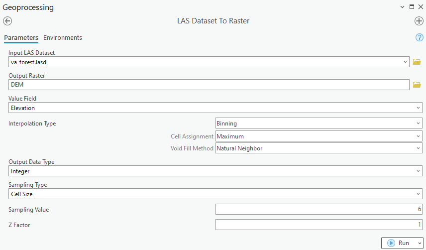
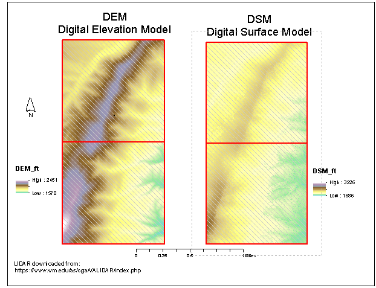
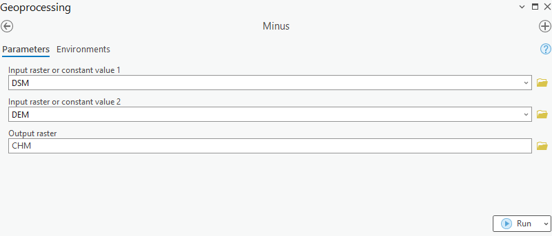
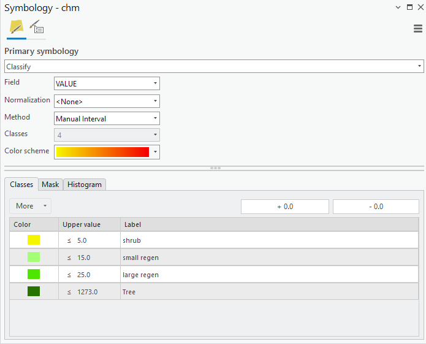
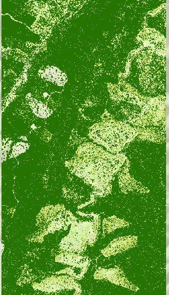

## Overview
This FloridaView laboratory is part of the **LiDAR Remote Sensing Learning Path**. It has been migrated from the original course document into a single Markdown source so the web tutorial and downloadable PDF can be updated together.

## Learning objectives
- Create bare-earth and surface elevation products from LiDAR.
- Calculate vegetation height from LiDAR-derived surfaces.
- Classify vegetation height for forest analysis.

## Prerequisites and software
- **Software:** ArcGIS Pro
- Review the [Software & Access](../software.md) page before starting.
- **Teaching data: not yet published.** The named course datasets are unavailable for public download. Check the [FloridaView Data](../data.md) page for availability; FAU students should use the dataset supplied by their instructor. Procedures that require these files cannot be completed from the website alone.

:::{note}
**FAU students:** use the submission template available from this page's download menu. Course-specific submission instructions may still be provided through your current FAU course environment.
:::

---

## Background:
Land managers can learn a great deal about the history of a forested site based on the amount, distribution, and height of the vegetative cover. The impact of wildfire and disease, the growth of young trees, and the presence of habitat features favored by certain wildlife species are all important types of information that can be derived from lidar. Most of this information is currently collected through time-intensive ground surveys and difficult in remote locations. Increased efficiencies in data collection would be welcomed by land management agencies and advocacy organizations.

The Nature Conservancy’s Virginia and Pennsylvania chapters want to use lidar to estimate the extent of various successional stages of forest evolution using vegetation height as a surrogate for age. This knowledge will allow the land managers to better understand what restoration and management techniques may be necessary to maintain a diversity of forest communities and species. Lidar provides the opportunity to characterize different strata in ways previously not possible using satellite imagery. Canopy height can be determined by subtracting the bare earth surface (DEM) from the 1st return surface (DSM) derived from lidar measurements to characterize the growth of trees.

This lab will teach you how to use lidar data collected over forested areas to characterize tree canopy height by creating a Canopy Height Model (CHM) for a project area.

## Lab objectives:
- Investigate LAS dataset for designated forest.

- Create DEM and DSM rasters from LAS dataset.

- Generate CHM.

- Identify and investigate problem areas in the lidar.

- Produce a classified map of canopy vegetation.

## Project area:
George Washington National Forest, Virginia

## Data
The named teaching dataset is not yet available for public download; see the [data availability notice](../data.md).

## Part 1: Load in las dataset and corresponding datasets
- Start ArcGIS Pro and create lab6 map project and save it to a project folder. Pls do not put space or special letters in the project folder name or working path because errors may occur due to space or special letter in working path.

- Load in the dataset in the **va_forest.gdb**

- Move the studyarea_tiles to the top in Contents and change the symbology to highlight the two lidar tiles you will be working on.

- Load in the va_forest.lasd. This is the las dataset created from the two lidar tiles. The two original lidar files are in the **LAS_files**. You can also create your own las dataset with these two tiles using skills you have learned for this course.

The metadata for the LAS files is at: **\LAS_files/FGDC_USGS_NRCS_VA_LAS.xml**. In the metadata the classification scheme is given as follows:

- Class 1 = Unclassified. This class includes vegetation, buildings, noise etc.

- Class 2 = Ground

- VA_Augusta_2011

- Lambert_Conformal_Conic_2SP

- NAVD_1988_Feet

- Load Data 10/2011

- Tile 1.5 X 1.5 square mile

- 2011_VA_Augusta_2011_n16_3803_20

- 2011_VA_Augusta_2011_n16_3803_10

You should read the metadata of the lidar data you are working on. This helps you understand who, when, and where the data were collected and whether the resolution and time meet your project need.

- Save your project

Based upon the metadata we can filter the LAS data so that Class 1 gives the points for the Digital Surface Model (DSM) and Class 2 gives the data for the Digital Elevation Model. This class data can also be accessed under the Filters pull down menu. The metadata also gives the point spacing as 1.53 and 1.60, or an average of 1.55 ft.

Lidar data can be classified into various heights by selecting the proper codes. Remember, a DEM (Digital Elevation Model) is a bare-earth model that uses the last return. This can be compared to a DSM (Digital Surface Model), created from first returns or from the highest points above the ground. Raster data is one of the most common GIS data types. A wide range of analysis can be done with raster or gridded data. For the vegetation height analysis, you will convert the LAS dataset into a DEM and a DSM.

## Part 2: Creating a DEM
This part you will create a raster DEM dataset from the lidar las dataset.

- Remove VA Counties and GWNF from contents, and focus on the lidar area.

- Select the las dataset in Contents (va_forst.lasd), under LAS Dataset Layer, in Point Thinning group, set Full Resolution to 5000, and Display Limit to 5,000,000.

- Set the Las dataset Filter to **ground** (LAS Filter-Ground)

- Search for the **LAS Dataset to Raster** tool in Geoprocessing, and set the following parameters (Figure 1):

<!-- -->

- Input LAS Dataset =va_forest.lasd

- Output Raster = Name the raster **DEM** and store in your project folder.

- Value field = ELEVATION

- Binning represents the interpolation method used to produce the raster.

  - Cell Assignment Type = Maximum

  - Void Fill Method = Natural Neighbor

- Output Data Type = Integer

- Sampling Type = Cell Size

- Sampling Value = 6

- Click Run

> 

**If you get error, ensure the working folder/file path to save the DEM has no space and special letters.**

- Right click DEM, select Properties\>\>Symbology and pick an appropriate elevation color ramp.

## Part 3: Creating a DSM
This part will teach you to create a DSM from the las dataset.

- From the las dataset, set the filter to Non-Ground

- Search for the **LAS Dataset to Raster** tool in Geoprocessing

- Enter the same parameters used above in creating DEM except name the Output Raster DSM.

**Homework 1 (5 points):**

Produce a map with two data frames showing a DEM (2.5 points) and a DSM (2.5 points). Figure 2 is an example of my results.

Figure 2 Example maps of DEM and DSM.

## Part 4: Calculating Vegetation Height
To determine the vegetation height, the bare earth surface (DEM) will be subtracted from the digital surface model (DSM) or first return.

- Search for and activate the Minus Spatial Analyst Tool in Geoprocessing (Figure 3)

<!-- -->

- Input DSM as constant value 1.

- Input DEM as constant value 2.

- Name the output raster height as CHM (it refers to Canopy Height Model)

Figure 3 Calculation of CHM.

Obviously, the negative height values are indicative of errors. Any heights over 196 ft are also errors. There are no man-made structures in the study area and no trees in Virginia are over 196 ft tall. The errors in the data are probably a misclassification of the ground points.

- Open the height raster attribute table and investigate the data.

The eleven cells with a value of over 196 ft are insignificant. However, you should investigate the cells with negative values and search for possible reasons.

## Part 5: Classifying the Vegetation Height
You can further refine the vegetation height dataset based upon the CHM you created.

- Right click CHM, then Symbology\>Classify, set the height less than 5 as shrub (yellow), 5-15 as small regen (light green), 15-25 as large regen (medium green), and \> 25 as tree (dark green) (Figure 4), and save your project. An example of the classified map is displayed in Figure 5.

Figure 4 Reclassification of the CHM to refine the vegetation.

**Homework 2 (5 points):**

Produce a map of your CHM (2.5 points) and vegetation classification from CHM (2.5 points).

Submit homework using the provided submission template in PDF to Canvas.
