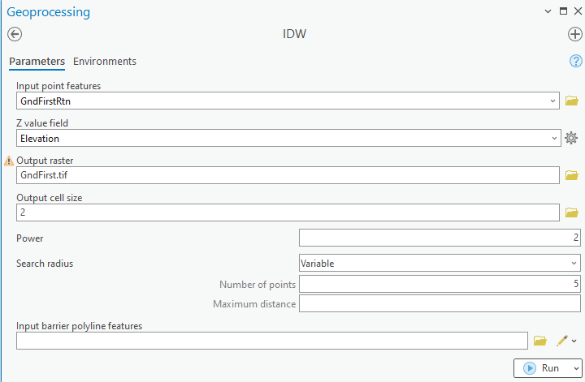
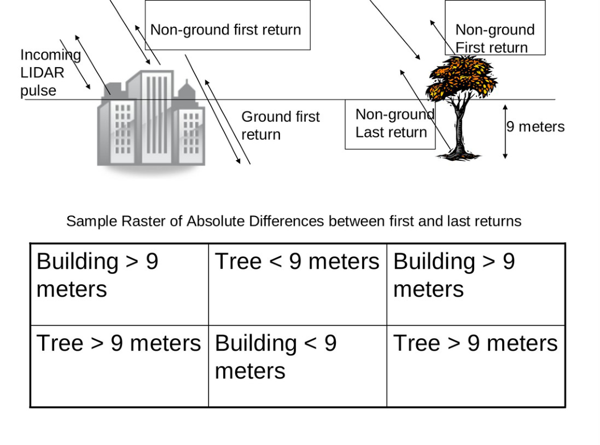
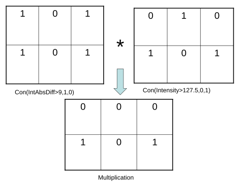
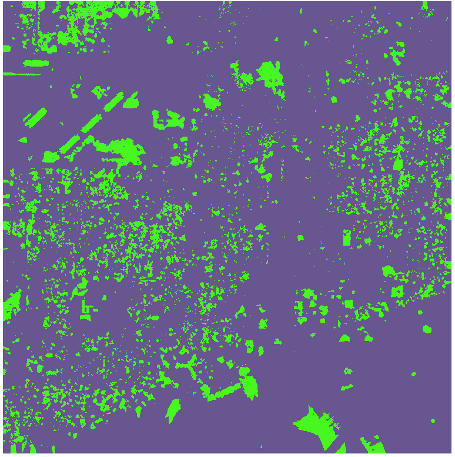
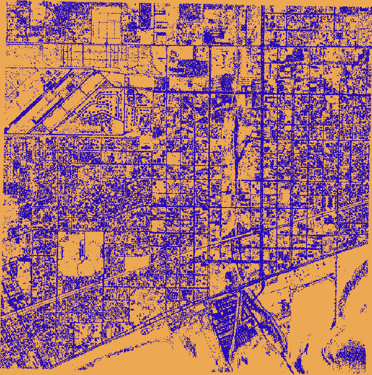
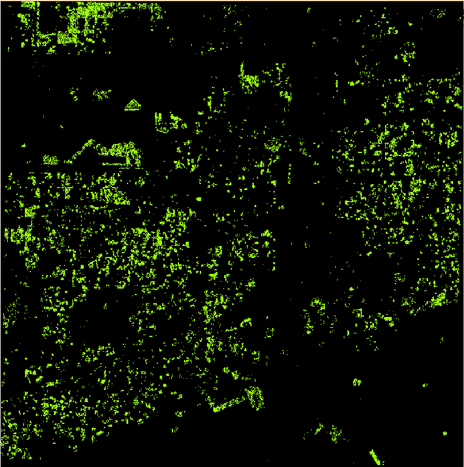
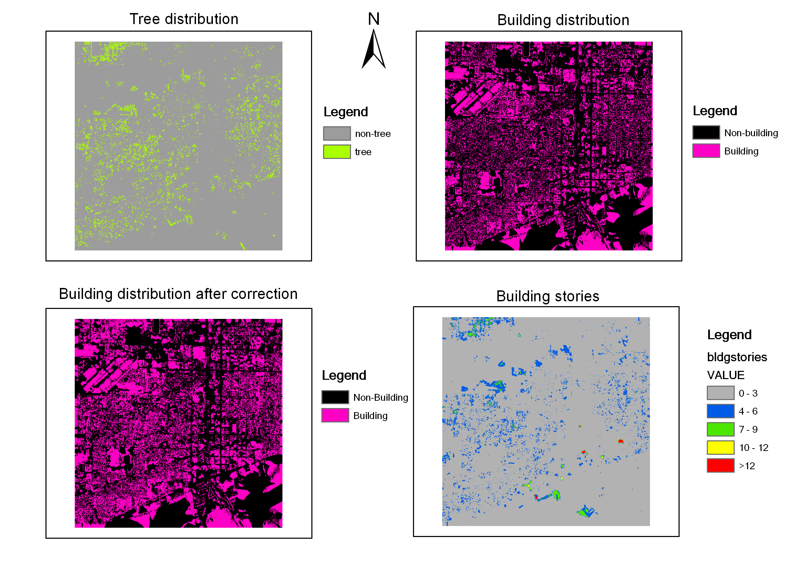

## Overview
This FloridaView laboratory is part of the **LiDAR Remote Sensing Learning Path**. It has been migrated from the original course document into a single Markdown source so the web tutorial and downloadable PDF can be updated together.

## Learning objectives
- Convert LiDAR point data to raster surfaces in ArcGIS Pro.
- Use return and intensity information to derive features.
- Apply raster-calculator logic to extract tall vegetation and other features.

## Prerequisites and software
- **Software:** ArcGIS Pro
- Review the [Software & Access](../software.md) page before starting.
- **Teaching data: not yet published.** The named course datasets are unavailable for public download. Check the [FloridaView Data](../data.md) page for availability; FAU students should use the dataset supplied by their instructor. Procedures that require these files cannot be completed from the website alone.

:::{note}
**FAU students:** use the submission template available from this page's download menu. Course-specific submission instructions may still be provided through your current FAU course environment.
:::

---

In this lab, you will learn how to extract trees and buildings from lidar raw data (ground/nonground first and last returns) and intensity image in ArcGIS Pro. These simple approaches will provide a quick solution for feature extraction from lidar data but may not provide a high-quality result compared to some commercial software or actual manual compilation.

## Data
**the corresponding FloridaView lab dataset**

## Lab materials
You can find the lidar raw data of Gulfport, Mississippi, downloaded from the NOAA public website in the lab folder. lidar raw data are in the form of x, y, z points in comma-delimited files.

1.  Non-ground and ground first return data are in folders **NonGroundFirstReturn** and **GroundFirstReturn**

2.  Non-ground and ground last return data are in folders **NonGroundLastReturn** and **GroundLastReturn**

You can also find an intensity image (.tif file) in each folder, which gives information about the strength of the laser pulse return from a surface.

**Step 1**. **Load in lidar point data and create point shapefiles in ArcGIS Pro**

1.  Copy the text file: In each of the data folders, copy the .txt data file to your working directory and rename it so you can work with it. (e.g. Grd1stRtn.txt).

2.  Load in the text file and create shapefile

    - Start ArcGIS Pro, and load in all four text files using the Add Data

    - Right click the loaded txt file and select **Create Points from Table-\> Make XY Event Layer** Specify Easting, Northing, and Elevation for the X, Y, and Z fields.

    - For the Coordinate System, select the projected coordinate systems directory, and choose the UTM, then the WGS 1984, Northern hemisphere and select **UTM Zone 16N** and press. Click OK.

    - A point feature layer is added in Contents, then right click this file and export data to save it as shapefile

    - Repeat the above steps to create shapefile for each text file

**Step 2**. **Converting a point shapefile to a raster dataset**

> This step requires the Spatial Analyst Extension tool, ensure that Spatial Analyst tools are activated. If not, you can go: Project\>\>Licensing\>\>Configure your licensing options. A dialogue box appears where you need to scroll down to find the Spatial Analyst tool and check on the box to activate it.

- Interpolation using IDW and create a raster dataset

1.  In the Geoprocessing toolbox and search IDW and find the **IDW (Spatial Analyst Tools) tool**.

2.  In the Inverse Distance Weighted entry box, select the shape file containing your points, and for the Z value field, select Elevation. The power option can be just left at 2. Set the output cell size to 2, and name the output raster, set the number of points to 5 instead of the default 12, **but be consistent when you are converting all the other input shape files**. All the other defaults can be left alone (Figure 1). It may take a few minutes to create a raster layer.

> Figure 1 Converting a point feature layer into raster layer using IDW tool.

3.  Repeat the above steps and create raster dataset for each point shapefile (**Tip: in Analysis-\>History, you can find the previous IDW procedure, where you can revise input and output files. In this way all other inputs will be consistent**).

4.  To create a hill shade raster, in Geoprocessing, search Hillshade, and select the Hillshade (Spatial Analyst Tools) to create hillshade of each raster data layer you created.

5.  You should notice a substantial lack of relief along with topographic features such as the coast and some canals. This is your DTM (Digital Terrain Model). The other one that includes buildings and trees is your DSM (Digital Surface Model). Save the project, and all four raster layers of hillshade and original raster datasets are in Contents.

**Step 3**. **Tree extraction**

Methodology rationale

> We consider trees as non-solid objects. That is, a first return is from the top of the tree, while a last return is from the lower parts of the tree or the ground (except for extremely dense vegetation). Thus, by identifying the regions where the first and last returns are at least 9 meters apart, it is possible to identify where trees over 9 meters are growing.
>
> The algorithm for determining mature tree locations is outlined in the Figures 2 and 3. We assume that the difference between first and last returns for tall trees is quite significant. Our raster images contain objects like trees with absolute first and last return differences over 9 meters and certain buildings, but we only want to keep the trees.
>
> The first conditional raster statement sets everything above 9 meters in difference to a value of one (this could include buildings and trees) and everything else is set to zero. The second conditional raster checks whether intensity is above a certain value. If it is, its value is reset to zero (i.e. all man-made objects). Everything else below the threshold is set to one (i.e. vegetation). Thus, when we multiply the two resulting binary images, we obtain values of one for cells containing trees with first and last return differences over 9 meters as shown in the figure 3. Everything else, including buildings, is set to zero.
>
> 
>
> Figure 2
>
> 

Figure 3

- Ensure needed raster files you have created from lidar point data in ArcGIS Pro.

1.  Once you have the first return and last return non-ground lidar raster files, make sure to also add the intensity lidar image in the folder of **NonGroundFirstReturn** into **ArcGIS Pro**.

2.  To follow the original exercise's BIL workflow, right click on each raster layer created before and select Data→Export Data. Change the format to Esri BIL and display the layer when exporting is complete. Repeat for all four raster layers (not the hillshade layers). ArcGIS Pro also supports TIFF rasters; BIL is the format used for consistency in this exercise, not a requirement of Raster Calculator. See Esri's [supported raster formats](https://pro.arcgis.com/en/pro-app/latest/help/data/imagery/supported-raster-dataset-file-formats.htm).

3.  In Geoprocessing, search Raster Calculator, and select Raster Calculator (Spatial Analyst Tool). Enter the following command:

> `Int(Abs("NongroundFirstReturn" - "NongroundLastReturn"))`
>
> Where NongroundFirstReturn and NongroundLastReturn are the raster layers (in Esri BIL format) corresponding to the first and last non-ground returns. This is necessary because this process deals with grouped cell values containing multiple disassociated values rather than first and last on a ray. Make the result permanent and save as IntAbsDiff. This will take the absolute difference of the first and last return. Save the result as IntAbsDiff.
>
> **If it gives an error, check the inputs. Try to select the files and mathematical expressions from the option provided in Raster Calculator to make the expression the same.**

4.  Under Raster Calculator, enter the following command to do the first conditional operation:

> `Con("IntAbsDiff" >= 9, 1, 0)`
>
> This sets every value in the input difference map to one if the difference is greater than or equal to 9 meters. Make permanent and save the result as a raster named Diff9. The result of this operation can be seen in Figure 4.
>
> 
>
> Figure 4

5.  Under Raster calculator again, enter the following command to do the second conditional operation using the intensity image loaded into ArcGIS Pro:

> `Con("Intensity" > 127.5, 0, 1)`
>
> This sets every value in the intensity image to 0 if the intensity of the lidar return is greater than 127.5. Everything else is set to one. Make permanent and save the result as a raster named RclsIntensity. The result of this operation can be seen in Figure 5.
>
> 

Figure 5

6.  Finally, under Raster calculator, multiply the RclsIntensity raster with the Diff9 raster. The command is:

> `"Diff9" * "RclsIntensity"`
>
> This sets every cell that has a tree greater than equal to 9 meters in height to a value of one. Everything else is zero. Make permanent and give the output a name like Tree9. The resulting image should look something like the Figure 6.
>
> The resulting image clearly shows the location of mature trees, probably live oak trees over 9 meters tall, in the urban environment of Gulfport, MS. There maybe some misclassification with tall street signs or light poles, especially near the piers and jetties that extend into the Gulf of Mexico.

Figure 6 Extracted trees

## Homework
Using the same logic and the input raster images for the ground and non-ground first returns along with the intensity image, create a raster image using Raster Calculator that only displays buildings above a height of 3 meters from the ground.

Make a map of your final extracted trees and buildings (**10 points**). Your results should be like Figure 7. Use the provided submission template to submit in Canvas.

- **Int( Abs( “GroundFirstReturn” – “NonGroundFirstReturn”) ) → \[IntAbsDiff2\]**

- **Con( “IntAbsDiff2” \>= 3, 1, 0 ) → \[Diff3\]**

- **1-“RclsIntensity” → \[RvRclsIntense\]**

- **“Diff3” \* “RvRclsIntense” → \[Bldg3\]**

Figure 7.
