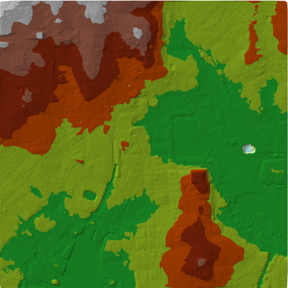
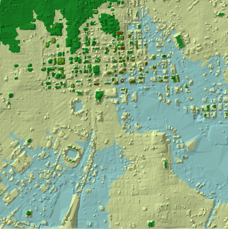

## Overview
This FloridaView laboratory is part of the **LiDAR Remote Sensing Learning Path**. It has been migrated from the original course document into a single Markdown source so the web tutorial and downloadable PDF can be updated together.

## Learning objectives
- Create DEM and DSM products from urban LiDAR.
- Derive building heights and construct a 3D urban scene.
- Build and compare terrain and surface models.

## Prerequisites and software
- **Software:** ArcGIS Pro
- Review the [Software & Access](../software.md) page before starting.
- **Teaching data: not yet published.** The named course datasets are unavailable for public download. Check the [FloridaView Data](../data.md) page for availability; FAU students should use the dataset supplied by their instructor. Procedures that require these files cannot be completed from the website alone.

:::{note}
**FAU students:** use the submission template available from this page's download menu. Course-specific submission instructions may still be provided through your current FAU course environment.
:::

---

It is now feasible to model urban landscapes at both the city and building level**.** 2D and 3D urban models can show detailed terrain, buildings, streets and urban vegetation. Models using both raster and terrain formats are available to city planners and can be used to evaluate space and to simulate building plans to inform local communities. Baltimore has asked your GIS company to provide them with two types of models to examine**.** They would like models of the city in both raster and terrain data formats.

Raster or gridded elevations models can be made from LAS datasets. The LAS data can be broken into different segments based on the returns. The most common segments are ground and first return. Ground represents bare earth or surface topography and first return typically includes buildings and tree canopy. Ground is often referred to as DEM (Digital Elevation Model) and first return as DSM (Digital Surface Model).

Terrains are produced by using a combination of points and breaklines to produce a series of TINs, each of which has its own map-scale range. The use of terrains as a data storage and visualization method enables faster viewing than other elevation data types. Storing surface information as feature classes in a geodatabase is one of the benefits of creating a terrain dataset. Breaklines usually represent lakes, shorelines, large rivers, or they are used to delineate a study area. Both data formats have pros and cons. City officials would like you to assess the different models and advise them on appropriate uses.

## Lab objectives
- Create a geodatabase and a feature dataset.

- Convert a LAS dataset into a raster.

  - DEM (digital elevation model)

  - DSM (digital surface model)

  - Convert 2D buildings into 3D buildings

  - Convert streets to elevated shapefiles

- Convert a point cloud into a terrain.

  - Incorporate breaklines

- Compare the models.

## Data
This is a lidar dataset obtained for Baltimore footprints.

## Part 1: Create a DEM raster dataset from lidar LAS dataset
- Create a lab8 ArcGIS Pro map project in your working folder.

- Load in the files baltimore_city and water from the geodatabase in the data folder.

- To change the LAS Dataset to a raster, the water areas that have no lidar points must be excluded.

- Start Catalog: View-\>Catalog Pane, then connect the lab data folder to the Folders in Catalog, so that the Baltimore_tile.lasd will show up in Catalog; right click the las dataset-\>Properties-\>Surface Constraints, add the **baltimore_city** layer as the constraints for DEM creation, set the surface feature type to Hard Clip (I may already set it up in the las dataset, if not you can set up the constraint).

- Add the baltimore_tiles.lasd dataset.

- To make a bare earth model or DEM, you need to filter the LAS dataset so that only the points that represent the ground are selected.

- Set the Las Filters of the LAS Dataset to Ground (you have learned this before)

- In Geoprocessing, find the LAS Dataset to Raster, and create a DEM raster dataset by setting the following parameters:

<!-- -->

- Input LAS Dataset =baltimore_tiles.lasd

- Output Raster – Name the raster baltimore_DEM.tif and store in your working folder.

- Value field = ELEVATION

- Binning represents the interpolation method used to produce the raster.

  - Cell Assignment Type = MAXIMUM

  - Void Fill Method = NATURAL_NEIGHBOR

- Output Data Type = Integer

- Sampling Type = CELLSIZE

- Sampling Value = 10

- Click OK.

<!-- -->

- Classify the raster and select an elevation color ramp. Format the cells so that there are no decimals.

## Part 2: Create a DSM raster dataset from lidar LAS dataset
- To construct a DSM (Digital Surface Model), using the same tool LAS Dataset to Raster, but ensure to set the las filters to Non Ground first. (**Tip, go to Analysis, History to pull out the previous step for creating DEM, just revise the output to DSM. This will use the consistent parameters for input as the DEM creation**).

- Name the file baltimore_DSM.tif and save in your working folder.

- Classify the raster and select an appropriate color ramp.

- Save the project.

## Part 3: Extract building height
This part involves extracting the height of buildings from your created DSM surface. It is a process that is more easily done in ArcGIS. You’ll first change the building polygons to points, then you’ll obtain heights from the DSM you created earlier, and finally you’ll add those heights to the building layer.

- In the map project where you still have your DEM and DSM loaded.

- Add bldgs from the baltimore_data/baltimore_layers/baltimore.gdb. If you open the attribute table for bldgs., there is no height value included.

- Right click bldgs\>\>Data\>\>Export Data and output the feature class in your working folder and name the file bldgs2.

- Remove bldgs.

- Run the Feature to Point tool (can search the tool in Geoprocessing):

  - Input: bldgs2.

  - Output Feature Class: bldgs_point.

- Add baltimore_DSM. This is the surface you are going to use to obtain the height values of the buildings.

- Search for Add Surface Information:

  - Input Feature Class = bldgs_point.

  - Input Surface = baltimore_DSM.

  - Check Z.

- To add the building heights to bldgs2, you need to join bldgs\_ point to bldgs2.

- Right click bldgs2 and go to Join and Relates and Choose Join

- Choose the FID to join two features and Click OK

- Right click bldgs2-\>Data-\>Export Data, can keep the Z value field only by setting Fields-\>Field Map and choose which fields to export. Save file in as bldgs3.

- Save project.

## Part 4: Construct a 3D scene
- In Map project, Add Data-\>Elevation Source Layer…, and load in your created DEM dataset, it will load the DEM as a Gound in the map. Now you have the las dataset, DEM, DSM, city, and water, bldgs3, and DEM as Gound in the Elevation Surfaces in Contents, you can remove the las dataset, city and water layers in the map project.

- Go to View-\>Convert-\> To Local Scene; this will create a 3D scene for your project. You can exercise the 3D view of your created DEM, DSM, and try to check/uncheck the Elevation Surface and see the different view between 2D and 3D.

- Show building in 3D

<!-- -->

- You can change the color of the building using Symbology function

- Right click on the bldgs3, go to Properties, set Elevation-\> Features-\> on the ground; Display-\>Display field, set to Z.

- Now you get a 3D view of the building with elevation displayed.

## Part 5: Construct a terrain model
A terrain dataset is a TIN-based surface built from measurements stored as features in a geodatabase. A terrain dataset is a good way to manage a large collection of points such as lidar. However, you cannot view terrains in 3D. To create a terrain dataset, the LAS files must be converted to points. As with the raster displays, the points can be filtered into ALL, Ground and Non-Ground.

- In the Catalog, find the geodatabase (Lab8.gdb) folder, right click New-\>Feature Dataset, to create a feature dataset named **terrain_layers**, set projection to NAD_1983_StatePlane_Maryland_FIPS_1900_Feet (this can be easily done by selecting one of the existing layers).

- In Geoprocessing, find the **LAS to Multipoint** tool:

<!-- -->

- Input the four LAS files from the baltimore_data folder.

- Output Feature Class= lab8.gdb/terrain_layers/ ptclouddsm

- Average Point Spacing = 3

- Class code = 1

- Coordinate System= NAD_1983_StatePlane_Maryland_FIPS_1900_Feet.

<!-- -->

- Repeat the above step, but choose 2 for class code, which represents all the ground points. Name the file ptclouddem.

- Open the attribute table of each feature layer. Point Count is the number of points per value. Right click PointCount and look at statistics.

You now need to turn each of these point cloud datasets into terrains.

- In Catalog, Right click lab8.gdb/terrain_layers\>\>New\>\> Terrain Dataset

  - Name=terrain_DEM

  - Average spacing= 3

  - Select=ptclouddem

  - Finish and Build Terrain

<!-- -->

- Repeat and generate DSM terrain named as Terrain_DSM by selecting ptclouddsm

- Load in your created DEM and DSM terrain in Map (an example shown below)

Terrain DEM created from ground points.

Terrain DSM created from non-ground points.

**Homework**

Make a map of your created DEM, DSM (3 points)

Make a map of your created DEM terrain and DSM terrain (5 points)

Make a map of your 3D buildings (2 points)

Submit all three deliverables in PDF to canvas. A submission template is provided.
