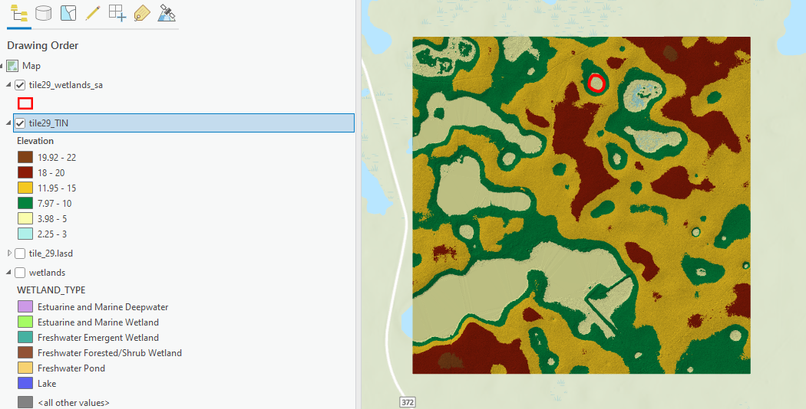
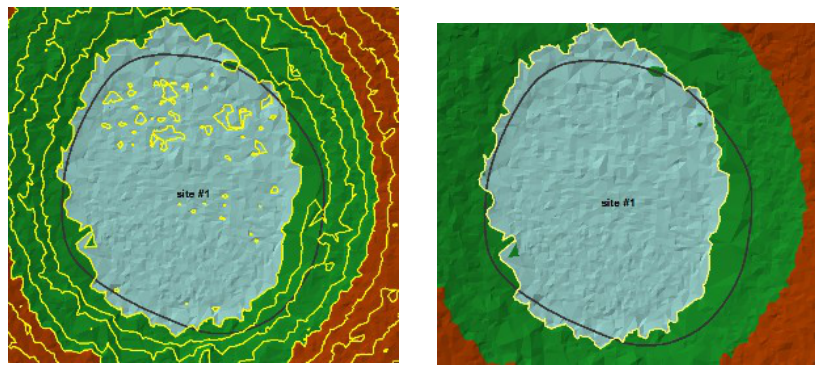
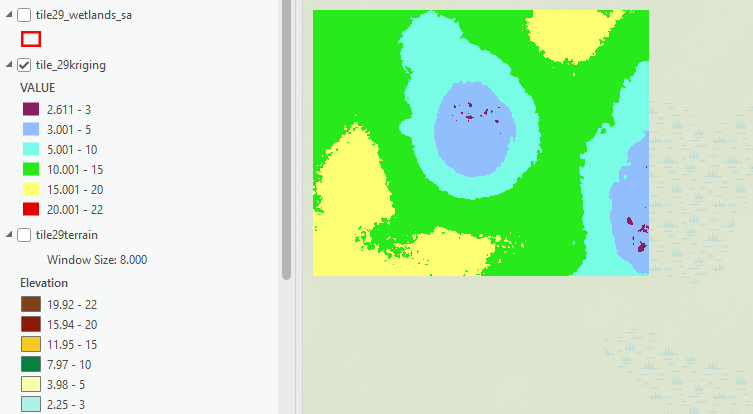

## Overview
This FloridaView laboratory is part of the **LiDAR Remote Sensing Learning Path**. It has been migrated from the original course document into a single Markdown source so the web tutorial and downloadable PDF can be updated together.

## Learning objectives
- Create LiDAR-derived TIN, terrain, and interpolated raster surfaces.
- Use contours and elevation surfaces to delineate depressional wetlands.
- Compare LiDAR-derived delineations with National Wetlands Inventory data.

## Prerequisites and software
- **Software:** ArcGIS Pro
- Review the [Software & Access](../software.md) page before starting.
- **Teaching data: not yet published.** The named course datasets are unavailable for public download. Check the [FloridaView Data](../data.md) page for availability; FAU students should use the dataset supplied by their instructor. Procedures that require these files cannot be completed from the website alone.

:::{note}
**FAU students:** use the submission template available from this page's download menu. Course-specific submission instructions may still be provided through your current FAU course environment.
:::

---

Wetlands have traditionally been delineated using field inventories. Field inventory requires considerable time in the study area by experienced scientists to make the required observations. Lidar, combined with the use of GIS, offers an opportunity for off-site delineation of wetlands.

The state of Florida has decided to establish a Wetland Center to do advanced research comparing traditional field-based delineation of wetlands to off-site delineation using lidar. They have asked for an analysis exploring the use of lidar to delineate depressional wetlands. Depressional wetlands are best suited for detection by lidar because of the strong relationship between the boundary of the wetland and elevation. They have asked for a complete comparison between field-based and off-site lidar-based delineations using multiple methods of analysis. For this lab the wetlands identified by the National Wetlands Inventory (NWI) will be used as the field-based component to compare with the lidar-derived delineation of wetland depression. You will learn three techniques (TIN, Terrain, and Kriging) in ArcGIS Pro for such purpose using lidar las dataset.

## Detailed lab objectives
- Production of lidar TINS with contours.

- Production of lidar terrains with contours.

- Conversion of DEM point cloud to raster by Kriging with contours.

- Comparison of the three types of wetland delineation to the National Wetlands Inventory delineation.

## Data
**the corresponding FloridaView lab dataset**

lidar data for Wakulla, Florida is downloaded from an open web; Wetlands data was downloaded from: <http://www.fws.gov/wetlands/Data/Data-Download.html>.

## Part 1: Create your wetland project in ArcGIS Pro
By this part, you will set up your wetland project in ArcGIS Pro.

1.  Start ArcGIS Pro and create a flwetlands map project in your working folder (e.g., lab9) to store your results. You can store your data inside your working folder. ArcGIS Pro will automatically create a geodatabase (flwetlands) in the project which you can see it by activating Catalog Pane under View.

2.  Connect to the folder project1_fl_data in Catalog by right click the Folders-\>Add Folder Connection. In this folder you will see a folder that holds the LAS files for Wakulla County, Florida. The following is the metadata for the LAS files.

    - Wakulla_County_2008

    - Lambert_Conformal_Conic_2SP

    - NAVD_1988_Feet

    - Load Data 2007

    - Tile 1 X 1 square mile

    - LID_2007_065029_N.las

    - LID_2007_065031_N.las

3.  Add the files counties, Wakulla, wetlands and tile_29.lasd from fl_wetlands.gdb/Layers. Open the attribute table for wetlands and look at the different types of wetlands. Classify the wetlands by WETLAND_TYPE and make them an appropriate color (Symbology, Primary symbology=Unique Values, Field 1=WETLAND TYPE). This will help you understand your project area and what type of wetlands over this area.

## Part 2: Delineate depression from lidar-derived TIN and contours
This part will teach you how to use the Triangulated Irregular Network (TIN) technique to delineate wetland depression from lidar las dataset. We will convert a LAS dataset into a bare earth TIN. Each tile must be done separately.

1.  Add file tile29_wetlands_sa from fl_wetlands.gdb\Layers. Make it hollow with a wide border and label the site (this is the site 1 location).

2.  Select tile_29.lasd in Contents and set the Las filter to Gound.

3.  Open the tool LAS Dataset to TIN in Geoprocessing (Analysis-\>Tools), and use the following parameters:

    - Input LAS Dataset =tile_29.lasd

    - Output TIN – Name the dataset **tile29_TIN** and save it in your project folder, outside the `.gdb` geodatabase.

    - Thinning Type = RANDOM

    - Thinning Method = PERCENT

    - Thinning Value = 75

    - Maximum Value = 8,000,000

    - Click OK.

4.  Right click tile29_TIN and go to Symbology\>\>\>Classified into 6 classes. Use Defined Interval and choose appropriate Break Values (Figure 1).

Figure 1 Lidar-derived TIN dataset.

The next part of the exercise uses the surface contour tool. This tool uses a TIN or a terrain dataset to calculate contours. Contours are generated directly from the TIN or terrain dataset within its zone of interpolation. Linear interpolation is used. With this interpolation, each triangle is treated as a plane. Portions of individual contours within a triangle are straight. Any change in direction occurs only when a contour passes from one triangle into another. This type of contouring produces engineering-quality contours, representing an exact linear interpretation of the surface model.

Linear interpolation is generally considered conservative and often represents the best estimate for analysis. The resulting contours are not smooth, though, and generally aren't used for aesthetic cartographic output.

1.  Search for Surface Contour in Geoprocessing and enter the following parameters:

- Input surface = tile29_TIN.

- Output Feature Class = flwetlands.gdb/Layers/TINcontour_1ft. (Layers is a feature dataset you need to create in Catalog in your flwetlands.gdb. You have learned this in previous lab. This feature dataset can hold multiple feature datasets; Right click the geodatabase New\>\>\>Feature Dataset)

- Contour interval = 1.

- Click OK.

2.  Zoom into site \#1 and **select the contour** that matches the tile29_wetlands_sa the most closely (Figure 2).

Figure 2. Select the contour that best matches the wetland boundary, then convert it to a polygon to compare acreage.

Export the selected contour to `flwetlands.gdb/Layers/sa_TIN_1ft` using **Data → Export Features** before the next step.

3.  Search for and open the tool **Feature to Polygon** in Geoprocessing.

    - Input Features = sa_TIN_1ft

    - Output Feature Class = Layers/poly_TIN_29

    - Click Run

4.  Make the polygon hollow with a border of 3 and a distinctive color.

5.  Remove TINcontour_1ft.

6.  Remove sa_TIN_1ft.

If you open the attribute table of tile29_wetlands_sa, you will see that the area is not only given in square feet but also in acres. It would be much easier to make comparisons if the poly_TIN_29 also gave area in acres. One acre is equal to 43,560 square feet.

7.  Open the attribute table for poly_TIN_29. In the upper left you can access the pull down Field View, and then Add new field.

- Filed Name = acres.

- Data Type = float.

8.  After the field is created, then click Save.

9.  Open attribute table of the poly_TIN_29, and right click the acres field, Calculate Geometry, select Area for Property, set US Survey Acres for Area Unit, and Current map for Coordinate System. The area in acres for the site will be calculated.

You should now have two delineated wetland polygons for site \#1. The original polygon was taken from the National Wetlands Inventory and the second polygon was calculated by changing a lidar las dataset to a TIN. This completes the first type of wetland delineation.

## Part 3: Delineate depression from lidar-derived terrain and contours
Terrains are TIN-based surfaces built from measurements stored as features in a geodatabase. They are useful in managing lidar because of the massively large point dataset elevations. Terrain pyramids are levels of detail generated for a terrain dataset to improve efficiency. They are used as a form of scale-dependent generalization. Pyramid levels take advantage of the fact that accuracy requirements diminish with scale.

Terrain pyramids are generated through the process of point reduction, also known as point thinning. This reduces the number of measurements needed to represent a surface for a given area. For each successive pyramid level, fewer measurements are used, and the accuracy requirements necessary to display the surface drop accordingly. The original source measurements are still used in coarser pyramids, but there are fewer of them. No resampling, averaging, or derivative data is used for pyramids.

1.  Access the tool **LAS to Multipoint** in Geoprocessing and set the following parameters:

- Input LID2007_065029.N.las from the LAS_files folder in project1_fl_data.

- Output Feature Class = flwetlands.gdb/Layers/tile29_ptcloud_dem (Layers is the feature you created in the geodatabase previously)

- Average Point Spacing = 2.

- Input Class Code = 2 (Ground).

- Click Run.

2.  In Catalog, Right click Layers in the flwetlands.gdb to activate the New Terrain Dataset wizard. Use the following parameters:

- Enter the name for the terrain as **tile29terrain**

- Enter 2 as the Point Spacing.

- Select the tile29_ptcloud_dem.

- Click next, next.

- For Window Size select **Closest to Mean Z**. Window size-based thinning is fastest and is good at reducing noise.

- Click next, next.

- Click next, Finish and then Yes to create the new terrain. **If the Build terrain window is activated, Click Run**.

3.  Right click tile29terrain and go to Symbology\>\>\>Classified using 6 classes. Use Defined Interval and choose appropriate Break Values.

4.  Search for and activate **Surface Contour** in Geoprocessing, and use the following parameters:

- Input surface = tile29terrain.

- Output feature class = flwetlands.gdb /Layers/terrain29_1ft

- Contour interval = 1.

5.  Zoom in and select the contour closest to site \#1.

6.  Search for and open the tool Feature to Polygon.

- Input Features = terrain29_1ft

- Output Feature Class = flwetlands.gdb/Layers/poly_terrain_29

- Run; This will only save the selected contour as a polygon layer.

7.  Make poly_terrain_29 hollow with an increased border size and a distinct color.

8.  Remove terrain29_1ft.

Similarly, you can calculate acreage for poly_terrain_29 by adding the field acres as float and using the Calculate Geometry function.

## Part 4: Delineate depression from lidar-derived contours of Kriging interpolation
Kriging is an advanced geostatistical procedure that generates an estimated surface from a scattered set of points with z-values. Unlike other interpolation methods, the Kriging tool effectively involves an interactive investigation of the spatial behavior of the phenomenon represented by the z_values before you select the best estimation method for generating the output surface.

1.  Add the file sa_kriging from the fl_wetlands.gdb

2.  Clip the data to area of interest: find Clip in Geoprocessing, Input tile29_ptcloud_dem and use sa_kriging as the clip feature. Name the file sa_ptc_kriging and store in the flwetlands.gdb.

3.  Remove sa_kriging and tile29_ptcloud_dem.

4.  Search and find the tool Kriging (Spatial Analyst Tools) in Geoprocessing and set the following parameters:

- Input sa_ptc_kriging.

- Z value field = Shape.Z

- Output surface raster = flwetlands.gdb/tile29_kriging (Save it to your geodatabase flwetlands.gdb)

- Output cell size=3

- Accept the default.

- Click Run.

5.  Remove sa_ptc_kriging.

6.  Right click tile29_kriging and go to Symbology\>\>\>Classified into 6 classes. Use Defined Interval and choose appropriate Break Values (see Figure 3).

7.  Search for and activate Contour (Spatial Analyst Tools) (Not Surface Contour) in Geoprocessing and use the following parameters:

- Input raster = tile29_kriging

- Output feature class = flwetlands.gdb/Layers/kriging29_1ft

- Contour interval = 1.

8.  Zoom in and select the contour closest to site \#1.

9.  Search for and open the tool Feature to Polygon in Geoprocessing.

- Input Features = kriging29_1ft.

- Output Feature Class = flwetlands.gdb/Layers/poly_kriging_29

- Save

10. Make poly_kriging_29 hollow with an increased border size and a distinct color.

11. Remove kriging29_1ft

Figure 3 Lidar-derived Kriging interpolation result.

## Homework
Map a map of three types of delineation results (7 points) and show your estimated acreage of the delineated depression for the site (3 points).

Submit the homework in PDF to canvas. A submission template is provided in canvas.
