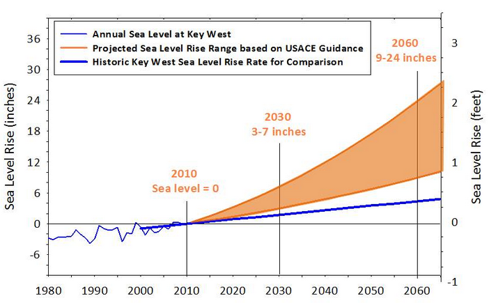
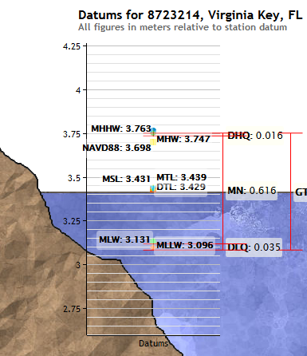
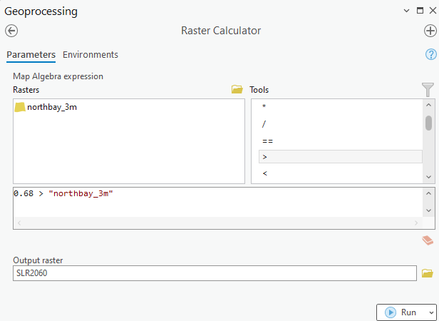
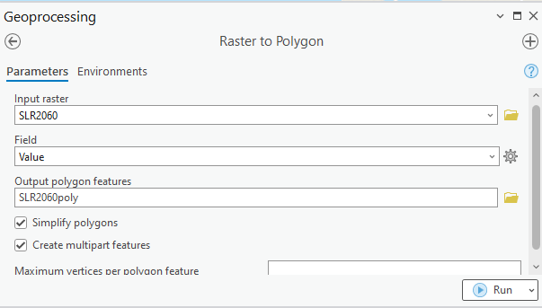
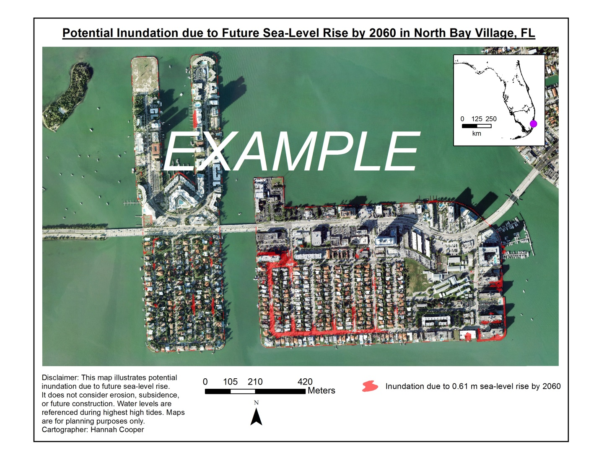

## Overview
This FloridaView laboratory is part of the **LiDAR Remote Sensing Learning Path**. It has been migrated from the original course document into a single Markdown source so the web tutorial and downloadable PDF can be updated together.

## Learning objectives
- Interpret future sea-level-rise scenarios and vertical-datum differences.
- Build a simple LiDAR-DEM bathtub inundation model.
- Convert inundation results to vector features for mapping.

## Prerequisites and software
- **Software:** ArcGIS Pro
- Review the [Software & Access](../software.md) page before starting.
- **Teaching data: not yet published.** The named course datasets are unavailable for public download. Check the [FloridaView Data](../data.md) page for availability; FAU students should use the dataset supplied by their instructor. Procedures that require these files cannot be completed from the website alone.

:::{note}
**FAU students:** use the submission template available from this page's download menu. Course-specific submission instructions may still be provided through your current FAU course environment.
:::

---

South Florida is one of the most vulnerable regions to sea-level rise (SLR) due to its porous limestone, dense population and ecosystems at low elevations and gentle slopes. Decision makers, faced with the problem of adapting to SLR, utilize elevation data to identify assets that are vulnerable to inundation (long-term flooding). Globally, the application of Digital Elevation Models (DEMs) for mapping SLR vulnerability has become a standard practice. However, the use of DEM’s with coarse horizontal resolution (e.g., 30 m) and low vertical accuracy restricts precise mapping of potential impacts. With the advancement of airborne Light Detection and Ranging (LiDAR), fine horizontal resolution (e.g., 3 m) and high vertical accuracy elevation data are becoming increasingly available for coastal hazard mapping. As a result, LiDAR is allowing for more accurate vulnerability maps to be produced for coastal zone managers responding to the threat of rising sea levels. The objective of this lab is to generate a SLR vulnerability map suitable for stakeholders at the city of North Bay Village using lidar-derived DEMs. These simple approaches will provide a basic assessment of potential land area inundated due to future SLR, but they do not incorporate uncertainty in the underlying data as do more advanced techniques (see References for Lab 10).

## Data
**the corresponding FloridaView lab dataset** (`.gdb`)

The LiDAR DEM is obtained from South Florida Water Management District (SFWMD). The State of Florida Division of Emergency Management collected the topographic LiDAR data between July to August 2007 for the study area. The vendor post-processed the LiDAR into ground and non-ground returns using proprietary software. The maximum post spacing reported is 1.2 m for unobscured areas. Ground returns and hydrographic breaklines were used by SFWMD to generate the 10 ft (~3 m) resolution LiDAR DEM. SFWMD followed National Digital Elevation Program (NDEP, 2004) guidelines to test Fundamental Vertical Accuracy (FVA) of bare-earth and low grass land class using 308 GPS-derived ground control points collected by the vendor to calculate RMSE of 6.5 cm.

The original 10-ft LiDAR DEM of Miami-Dade County, FL was modified in the following ways for this lab:

1.  Since the study area is North Bay Village, the LiDAR DEM was clipped to the city

2.  Feet to meters conversions: projected to North American Datum of 1983 (NAD 83) Universal Transverse Mercator (UTM) Zone 17 North; converted vertical units referenced to North American Vertical Datum of 1988 (NAVD 88) from feet to meters

The modified LiDAR DEM used in this lab titled “northbay_3m” is located in **SLR.gdb**. Copy the Lab10 folder over to your working directory.

:::{note}
**Historical teaching scenario:** this exercise retains the original 0.61 m by 2060 scenario and supplied datum illustration for reproducibility. It is not a current sea-level projection or a site-specific flood forecast.
:::

## Part 1: Future SLR scenarios
Since the objective of this lab is to generate a SLR vulnerability map derived from LiDAR for stakeholders, the Unified Southeast Florida SLR projections for planning purposes will be utilized. These projections were derived from one of the world’s longest recording tide stations, Key West tide station (1913-1999 data), and the US Army Corps of Engineers Guidance report. In the curve below, we will consider a worst-case scenario and use the upper bounds of SLR in South Florida of 0.61 m (24”) by year 2060 (Figure 1)

Figure 1. SLR scenarios. Obtained from:

<http://www.broward.org/NATURALRESOURCES/CLIMATECHANGE/Pages/SoutheastFloridaRegionalClimateCompact.aspx>

## Part 2: Discrepancies between vertical datums
It is common to map SLR above the higher high water mark where land is inundated by daily tides. One approach is to use NOAA’s vertical datum transformation tool, VDatum, to convert the LiDAR DEM from orthometric datum NAVD 88 to tidal datum Mean Higher High Water (MHHW). However, this process is beyond the scope of this lab. Instead, you will use observations from the nearest tide station, Virginia Key, in the figure below. Note that LiDAR elevations referenced to NAVD 88 are below MHHW at this location (Figure 2). Calculate the absolute difference between MHHW and NAVD 88 at this location. **Write this number down (round up to two decimal places) and add it to the SLR scenario of 0.61 m by year 2060**. This new value is important because it will be used in the next steps.

Figure 2. Example shows the difference of lidar Datum and tidal data Datum. Obtained from: <https://tidesandcurrents.noaa.gov/datums.html?id=8723214>

## Part 3: Create your lab10 project in ArcGIS Pro
1.  Start ArcGIS Pro and create lab10 project in your working folder

2.  In Catalog, connect the lab data folder to the project: Folders-\>Add New Folder Connection to link your data folder

3.  In Map, add the “northbay_3m” LiDAR DEM located in the SLR.gdb

4.  Using the basemap and imagery with labels and zoom out to familiarize yourself with the location of North Bay Village. The city is composed of two manmade islands that are result of dredging from the 1940’s (current total land area 0.9 km2). The 2010 US Census Bureau recorded a population of just over 7,000, most of which are year-long residents in single-family homes, high-rise ocean front condominiums, and apartment buildings.

5.  Using Symbology to change the color ramp for the “northbay_3m” so that you can better see differences in elevation:

## Part 4: Simple bathtub inundation model
1.  Search and open Raster Calculator (Spatial Analyst Tools) in Geoprocessing

2.  Map potential inundation due to future SLR using the following equation:

$${Inundation}_{x,y} = SLR > {LiDAR}_{x,y}$$

where *Inundationx,y* is a grid cell at *x*, *y* location inundated at 0 or 1 chance , *SLR* is the difference between MHHW and NAVD 88 added to 0.61 m (you calculated the difference in Part 2), and *LiDARx,y *is an elevation value of a grid cell at *x, y* location, all in meters. In other words, use logical operators (e.g., greater than, less than, etc) in Raster Calculator. Be sure to double click northbay_3m to add it to the expression and name the output SLR2060 to your lab10.gdb and click Run (Figure 3):

Figure 3. Using Raster Calculator to generate innundation dataset.

The output is a Boolean raster where all the values in the northbay_3m LiDAR DEM were reclassified as 0 (not inundated) and 1 (inundated).

## Part 5: Generating inundation feature dataset
1.  Search and open Raster to Polygon in Geoprocessing.

2.  Make sure to name your output SLR2060poly and save it to your geodatabase lab10.gdb (Figure 4).

Figure 4. Raster to polygon conversion.

3.  Go to the layer properties of the SLR2060poly layer under Contents → Symbology, set Unique Values, gridcode and Add all values (should only have 0 and 1).

4.  Open the attribute table of the SLR2060poly, and select gridcode=1, then in Contents, right click SLR2060poly, Data-\>Export Feature to export the selected polygons as SLR2060final to be saved in your project geodatabase lab10.gdb.

5.  Open the attribute table of SLR2060final. The total shape area in m2 should be shown in the last column called “Shape_Area”. Convert the area from m2 to km2 on your own or by adding a new field to the attribute table and calculating geometry for area in km2. Round up to two decimal places. This is the total land area vulnerable to potential inundation.

6.  Visualization of potential impacts: for the SLR2060final layer, go to Symbology and change the Fill Color to a different color (red works well if you are not color blind) and choose no color for Outline Color→ under Display tab, change Transparent to 40% then click OK.

7.  Add the NorthBay_2012aerial_m photo from the SLR.gdb. Make sure the SLR2060final layer in on top.

8.  Zoom in to a small scale such as 1:500. Both Islands will experience some flooding of facilities along the coast due to direct wave overtopping. If no adaptation strategies are taken, inland flooding of streets will be materialized as areas lacking drainage where the ocean rises through the storm drain system and prevents runoff from draining. Although most residents’ homes are dry, they will have difficulty accessing them by car. This is a common SLR issue that is particular for South FL: streets are much lower than buildings. Miami Beach is already beginning to experience flooding of streets during King tides in October (e.g., Alton Rd.). SLR vulnerability maps serve as important visualization tools so that we may identify assets at risk.

## Homework
Make a map of your final inundation analysis results (10 points). An example of the final SLR vulnerability map by year 2060 is shown below.

A submission template is provided in canvas.

